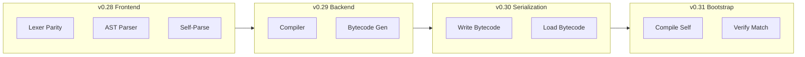

# Bootstrap: The Path to Self-Hosting

## Where We Are

After v0.20-v0.27, the language has all the runtime machinery needed for a compiler:
- **HashMaps** (v0.26) for symbol tables, environments, AST nodes
- **Pattern matching on maps** (v0.27) for AST dispatch: `#{"tag": "BinOp", "op": op} =>`
- **Closures + TCO** for recursive descent without stack overflow
- **75+ builtins** including file I/O, string manipulation, JSON serialization
- **`std/lexer.a`** (360 lines) already tokenizes "a" source
- **`examples/parse_file.a`** (383 lines) already parses a subset of the grammar

The two missing pieces are not features -- they are **code**: the actual self-hosted compiler, written in "a".

## The Bootstrap Roadmap



- **v0.28 -- Frontend**: Complete lexer + parser in "a" producing structural AST as tagged maps
- **v0.29 -- Backend**: Compile AST maps to bytecode (arrays of opcode maps)
- **v0.30 -- Serialization**: Write/load compiled programs to/from files
- **v0.31 -- Bootstrap**: The self-hosted compiler compiles itself; output matches the Rust compiler

## v0.28 -- Self-Hosted Compiler Frontend (The Next Step)

### Prerequisites: Two Small Language Additions

**1. String `+` operator** -- Compilers concatenate strings constantly. Currently requires `str.concat(a, b)` or interpolation. Adding `String + String` to `Op::Add` in the VM and `BinOp::Add` in the interpreter is ~10 lines of Rust.

In [src/vm.rs](src/vm.rs) `Op::Add` handler, add a `(Value::String, Value::String)` arm.
In [src/interpreter.rs](src/interpreter.rs) `BinOp::Add` handler, add the same.

**2. Lexer gap fixes** -- `std/lexer.a` is missing three tokens the parser needs:
- `_` (Underscore) -- used in patterns and destructuring
- `...` (DotDotDot) -- used in spread/rest syntax
- String interpolation (`"hello {name}"`) -- the Rust lexer splits these into `InterpStart`/`InterpMid`/`InterpEnd` tokens

### Core: Self-Hosted Parser with Map-Based AST

The architecture uses v0.26 HashMaps + v0.27 pattern matching as the backbone:

**AST nodes are tagged maps:**
```
; Function declaration
#{"tag": "FnDecl", "name": "add", "params": [
  #{"name": "a", "ty": "i64"},
  #{"name": "b", "ty": "i64"}
], "ret": "i64", "body": [...]}

; Binary operation
#{"tag": "BinOp", "op": "+",
  "left": #{"tag": "Literal", "kind": "Int", "value": 1},
  "right": #{"tag": "Ident", "name": "x"}}

; Match with guard
#{"tag": "Match", "expr": ..., "arms": [
  #{"pattern": #{"tag": "ArrayPat", "elems": [...]},
   "guard": #{"tag": "BinOp", ...},
   "body": ...}
]}
```

**Processing with pattern matching:**
```
match node {
  #{"tag": "BinOp", "op": op, "left": l, "right": r} => {
    compile_expr(l)
    compile_expr(r)
    emit_op(op)
  }
  #{"tag": "Call", "func": f, "args": args} => {
    each(args, fn(a) => compile_expr(a))
    emit_call(f, len(args))
  }
}
```

This is exactly what v0.26 and v0.27 were built for.

### File Structure

- `std/compiler/lexer.a` -- Upgraded from `std/lexer.a` with full token parity (~400 lines)
- `std/compiler/ast.a` -- AST node constructors: `mk_binop(op, l, r)`, `mk_call(f, args)`, etc. (~150 lines)
- `std/compiler/parser.a` -- Full recursive-descent parser producing AST maps (~1500-2000 lines)
- `tests/test_self_parse.a` -- Parse "a" source files and verify structure (~200 lines)
- `examples/dump_ast.a` -- CLI tool: `a run examples/dump_ast.a <file.a>` dumps AST as JSON

### Validation Strategy

The self-hosted frontend proves itself by parsing real "a" programs:
1. Parse `examples/math.a` (simple) -- verify AST structure via `json.stringify`
2. Parse `std/lexer.a` (medium) -- exercises control flow, string handling
3. Parse `std/compiler/parser.a` itself (hard) -- self-referential correctness
4. Compare token streams: `std/compiler/lexer.a` vs Rust `src/lexer.rs` on the same input

### What This Proves

When v0.28 is complete, the language can **read itself**. The parser produces the same logical AST structure as the Rust parser, represented as runtime values. This is the hardest part of bootstrapping -- once you can parse yourself, compiling and executing are mechanical.

## Estimated Scale

- **Prerequisites**: ~30 lines of Rust changes + ~60 lines of lexer.a fixes
- **AST module**: ~150 lines of "a"
- **Parser module**: ~1500-2000 lines of "a" (the largest "a" program ever written)
- **Tests + examples**: ~300 lines of "a"
- **Total new "a" code**: ~2000-2500 lines

This is ambitious but achievable. The `parse_file.a` example already covers ~40% of the expression grammar in 383 lines; extending to the full grammar with real AST output is the natural next step.
