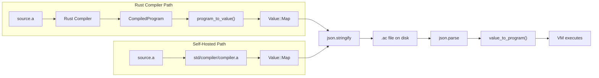

# v0.30 -- Serialization: Write/Load Compiled Programs

## Architecture

Two symmetric pipelines produce and consume the same `.ac` JSON format:



Both the Rust compiler and the self-hosted compiler produce the same map structure. Serialization is just `json.stringify` on that map. Loading is `json.parse` + the existing bridge.

## File Format: `.ac`

A `.ac` file is a JSON object with this schema (identical to the bridge's expected input):

```json
{
  "version": 1,
  "functions": [
    {
      "name": "main",
      "params": [],
      "locals": ["x", "y"],
      "chunk": {
        "code": [["Const", 0], ["SetLocal", 0], ["Return"]],
        "constants": [42, "hello", true, null],
        "strings": ["println", "to_str"],
        "lines": [1, 1, 2]
      }
    }
  ],
  "main_idx": 0
}
```

`null` represents `Void` in constants. The format is the same structure the bridge already deserializes.

## Changes by File

### 1. `src/bridge.rs` -- Inverse serializer (~100 lines)

Add `program_to_value` (the reverse of `value_to_program`):

- `op_to_value(op: &Op) -> Value` -- converts each `Op` variant to `Value::Array` (e.g., `Op::Call(3, 2)` becomes `["Call", 3, 2]`)
- `chunk_to_value(chunk: &Chunk) -> Value` -- wraps code/constants/strings/lines into a `Value::Map`
- `fn_to_value(f: &CompiledFn) -> Value` -- wraps name/params/locals/chunk
- `pub fn program_to_value(prog: &CompiledProgram) -> Value` -- wraps functions + main_idx

For `Value` constants: `Int` stays as-is, `Float` stays, `String` stays, `Bool` stays, `Void` becomes `Value::Void` (serialized as JSON `null` by existing `value_to_json`).

### 2. `src/main.rs` -- New `compile` command + `.ac` loading

**New `a compile` command:**
- `a compile <file.a>` -- compile with Rust compiler, write `<file>.ac`
- `a compile <file.a> -o out.ac` -- explicit output path
- `a compile <file.a> --self` -- use self-hosted compiler (lex/parse/compile in "a", serialize result)
- Implementation: read source, compile, call `program_to_value`, then `value_to_json` + `serde_json::to_string_pretty`, write to file

**Extend `a run` for `.ac` files:**
- Detect `.ac` extension on the input file
- Read JSON string, `serde_json::from_str` to `serde_json::Value`, convert to `Value` via `json_to_value`, then `value_to_program`, then `VM::new(program).run()`
- Skips lex/parse/compile entirely -- instant startup

### 3. `std/compiler/serialize.a` -- Self-hosted serialization module (~50 lines)

```
use std.compiler.compiler

fn serialize(prog) {
  let wrapped = #{"version": 1, "functions": prog["functions"], "main_idx": prog["main_idx"]}
  ret json.stringify(wrapped)
}

fn deserialize(s) {
  ret json.parse(s)
}

fn compile_to_file(src, path) {
  let prog = compiler.compile(src)
  let json = serialize(prog)
  io.write_file(path, json)
}

fn load_from_file(path) {
  let json = io.read_file(path)
  ret deserialize(json)
}
```

### 4. `examples/precompile.a` -- CLI precompilation tool

A self-hosted CLI that compiles `.a` files and writes `.ac`:

```
a run examples/precompile.a -- source.a [output.ac]
```

Demonstrates the full self-hosted pipeline: lex + parse + compile + serialize + write.

### 5. Tests

- **`tests/test_serialize.a`** (~15-20 tests): compile programs via self-hosted compiler, serialize to JSON, deserialize, verify structure matches original, execute via bridge
- **Roundtrip integration**: compile `examples/hello.a`, `examples/math.a`, `examples/fibonacci.a` via both Rust and self-hosted compilers, write `.ac`, load `.ac`, execute, verify output matches `a run`

### 6. `PLANNING.md` -- v0.30 milestone entry

## Key Design Decisions

- **JSON, not binary**: JSON is human-readable, debuggable, and uses existing infrastructure (`json.stringify`/`json.parse`, `io.write_file`/`io.read_file`). Binary can come later as an optimization.
- **Same format for both compilers**: The Rust and self-hosted compilers produce the exact same `.ac` format, proving they are interchangeable.
- **`null` for Void**: JSON `null` maps naturally to `Value::Void` through the existing `json_to_value` path.
- **Version field**: Future-proofs the format for changes in later versions.

## Estimated Scale

- `src/bridge.rs` additions: ~100 lines (inverse serializer)
- `src/main.rs` additions: ~50 lines (compile command + .ac loading)
- `std/compiler/serialize.a`: ~50 lines
- `examples/precompile.a`: ~40 lines
- `tests/test_serialize.a`: ~200 lines
- Total new code: ~450 lines
