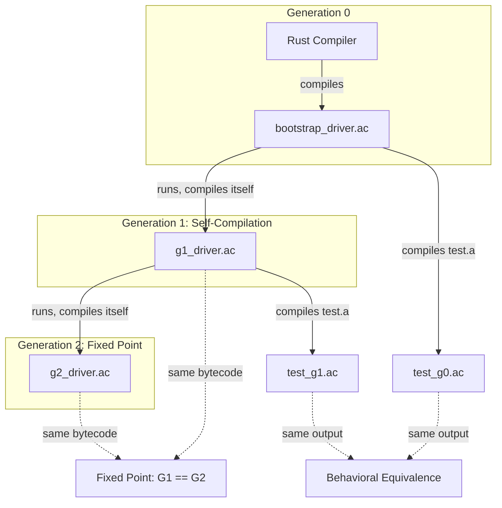

# v0.31 -- Bootstrap: Self-Hosted Compiler Compiles Itself

## What "Bootstrap" Means

The self-hosted compiler (`std/compiler/*.a`, 5,012 lines across 5 modules) must compile its own source code, and the resulting bytecode must execute correctly and produce equivalent output to the Rust compiler.

**Key insight:** `__bridge_exec__(prog, arg1, arg2, ...)` passes extra args to the child VM as `args()`. This lets us run a self-compiled driver program and pass it file paths, making the full bootstrap chain possible without any Rust-side changes.

## Prerequisite Fix

`examples/compile_and_run.a` line 17 reads `f["arity"]` which doesn't exist -- the field is `params`. Fix to `len(f["params"])`.

## New Files

### 1. `examples/bootstrap.a` -- Bootstrap proof driver (~80 lines)

A self-contained program that proves the bootstrap chain. It uses `std.compiler.compiler` and `std.compiler.serialize` to:

- **`compile` mode**: Act as a standalone compiler CLI (`args()[0]` = source path, `args()[1]` = output path)
- **`test` mode**: Run the full bootstrap chain automatically:
  1. Compile a simple test program with the self-hosted compiler (G0)
  2. Serialize, reload, execute -- verify correctness
  3. Self-compile this very driver program into G1
  4. Use `__bridge_exec__(g1_prog, "compile", "test.a", "output.ac")` to compile the test program via G1
  5. Load and execute the G1-compiled test program
  6. Report success/failure

The driver's `compile` mode ensures the compiled bytecode includes a `main()` that can be invoked by `__bridge_exec__`.

### 2. `tests/test_bootstrap.a` -- Automated bootstrap tests (~20 tests)

- **Self-compilation tests**: compile each compiler module through the self-hosted compiler:
  - `std/compiler/lexer.a` (463 lines, no imports)
  - `std/compiler/ast.a` (308 lines, no imports)
  - `std/compiler/parser.a` (1,526 lines, imports lexer + ast)
  - `std/compiler/compiler.a` (2,682 lines, imports lexer + parser)
  - Verify: no errors, function count > 0, structure valid
- **Behavioral equivalence tests**: compile simple programs with both Rust (`a compile`) and self-hosted compiler, execute both, verify identical output
- **Roundtrip chain**: G0 compiles test -> serialize -> reload -> execute -> verify
- **Full bootstrap test**: compile driver -> self-compile driver -> use self-compiled driver to compile test -> verify

### 3. `a compile --self` flag in [src/main.rs](src/main.rs)

Extend the existing `Compile` command with a `--self` flag that:
1. Reads and parses the source file with the Rust lexer/parser
2. Runs the self-hosted compiler (via `std/compiler/compiler.a` loaded as a module) in a child VM
3. Serializes the resulting program map to `.ac`

Implementation: compile a small driver program that `use std.compiler.compiler` and calls `compiler.compile_ast(ast)`, pass the parsed AST somehow... Actually, the simpler approach: compile the self-hosted compiler + a wrapper `main()` that reads the source file and compiles it. Then `__bridge_exec__` that with the source path as an arg.

Alternatively, since this is complex from the Rust side, we can **skip `--self` as a Rust CLI flag** and instead point users to `examples/precompile.a` (which already works) or `examples/bootstrap.a compile`. This is a pragmatic choice -- the bootstrap proof doesn't require Rust CLI integration.

### 4. `examples/compare_bc.a` -- Bytecode comparison tool (~60 lines)

Compares two `.ac` files and reports:
- Function count and name differences
- Opcode count per function
- Constant pool differences
- Behavioral: executes both and compares stdout

Used in the bootstrap chain to verify G0 and G1 produce equivalent output.

### 5. PLANNING.md -- v0.31 milestone

## Language Features Assessment

The self-hosted compiler sources use **only** these features (confirmed by exploration):
- `fn`, `let`, `let mut`, `ret`, `if`/`else`, `while`, `for`/`in`
- Arrays `[]`, maps `#{}`, field access `.`, index `[]`
- Builtins: `len`, `push`, `type_of`, `map.has`, `map.merge`, `str.join`, `str.chars`, `str.slice`, `str.split`, `str.starts_with`, `str.ends_with`, `int`, `float`, `is_alpha`, `is_digit`, `is_alnum`, `to_str`, `io.read_file`, `json.stringify`, `json.pretty`, `json.parse`, `io.write_file`
- String concatenation with `+`
- Type annotations (optional, e.g., `fn lex(src: str) -> [str]`)

**Not used**: string interpolation, match, try/?, closures, destructuring, spread. This dramatically simplifies bootstrap since these complex features don't need to be tested in the self-compilation path.

## Estimated Scale

- `examples/bootstrap.a`: ~80 lines
- `examples/compare_bc.a`: ~60 lines
- `tests/test_bootstrap.a`: ~200 lines
- Fix `examples/compile_and_run.a`: 1 line change
- PLANNING.md update: ~30 lines
- Total new code: ~370 lines
