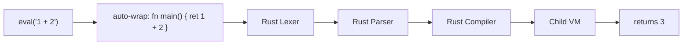

# v0.32 -- `eval`: Runtime Code Generation

## Design

`eval(code_string)` compiles and executes arbitrary "a" source code at runtime, returning the result. It uses the **Rust compiler** (not the self-hosted one) for speed and zero-dependency execution -- no `use std.compiler.compiler` needed.



**Semantics:**
- `eval("fn main() { ret 42 }")` -- compiles as-is, runs `main`, returns `42`
- `eval("1 + 2")` -- no `main` found, auto-wraps to `fn main() { ret 1 + 2 }`, returns `3`
- `eval("println(42)")` -- auto-wraps to `fn main() { ret println(42) }`, prints `42`, returns `void`
- `eval("fn fib(n) { ... }\nfn main() { ret fib(10) }")` -- multi-function program, returns `55`
- On compile/runtime error: returns `"eval error: <message>"` string (non-crashing, matches `__bridge_exec__` pattern)

**Execution model:** Isolated child VM (same as `__bridge_exec__`). No shared variables with the parent. Clean and predictable.

## Implementation

### 1. Rust-side `eval` builtin -- [src/vm.rs](src/vm.rs)

Add new imports at the top:
```rust
use crate::lexer::Lexer;
use crate::parser::Parser as AParser;
use crate::compiler::Compiler;
```

Add `eval` handling in `do_call` (before the `find_function` check, alongside `__bridge_exec__`):

```rust
if name == "eval" && nargs >= 1 {
    // pop extra args for child's args()
    let extra_args = if nargs > 1 { drain nargs-1 } else { vec![] };
    let code = pop string from stack;
    
    // Try compile as-is
    let compiled = self.eval_compile(&code);
    // If no main, try wrapping: "fn main() { ret <code> }"
    // Run in child VM, push result (or error string)
}
```

Add helper method `eval_compile(&self, code: &str) -> Result<CompiledProgram, String>`:
- Lex with `Lexer::new(code).tokenize()`
- Parse with `AParser::new(tokens).parse_program()`
- Compile with `Compiler::new().compile_program(&program)`
- If `main_idx.is_none()`, retry with `format!("fn main() {{ ret {} }}", code)`
- Uses same lex/parse/compile pipeline as [src/main.rs](src/main.rs) lines 98-151

Also support `eval(code, arg1, arg2, ...)` passing string args to the child VM's `args()`, mirroring `__bridge_exec__`.

### 2. Register `eval` as a builtin -- [src/builtins.rs](src/builtins.rs)

Add `"eval"` to the `is_builtin` match at line ~1181 so the name is recognized. The actual implementation lives in `vm.rs` `do_call` (same pattern as `__bridge_exec__`).

### 3. REPL example -- `examples/repl.a` (~25 lines)

A fully functional REPL built in "a" using `eval`:

```a
fn main() {
  println("a REPL v0.32 -- type 'exit' to quit")
  while true {
    io.write(">> ")
    let line = io.read_line()
    if line == "exit" { break }
    let result = eval(line)
    if type_of(result) != "void" {
      println(to_str(result))
    }
  }
}
```

### 4. Test suite -- `tests/test_eval.a` (~20 tests)

- **Expression eval:** `eval("1 + 2") == 3`, `eval("true") == true`, `eval("\"hello\"") == "hello"`
- **Statement eval:** `eval("let x = 5\nret x + 1") == 6`
- **Function eval:** `eval("fn fib(n) { ... } fn main() { ret fib(10) }") == 55`
- **Side effects:** `eval("println(42)")` runs without error
- **Builtins in eval:** `eval("len([1,2,3])") == 3`, `eval("to_str(42)") == "42"`
- **Map/array:** `eval("[1,2,3]")`, `eval("#{ \"a\": 1 }")`
- **Error handling:** `eval("undefined_var")` returns error string, doesn't crash
- **Nested eval:** `eval("eval(\"1 + 2\")") == 3`
- **Args passing:** `eval(code, "hello")` with `args()` in child
- **Multi-line programs:** Full programs with multiple functions

### 5. PLANNING.md update

Document v0.32 milestone.

## Estimated Scale

- `src/vm.rs`: ~50 lines (eval handler + eval_compile helper)
- `src/builtins.rs`: 1 line (add to is_builtin list)
- `examples/repl.a`: ~25 lines
- `tests/test_eval.a`: ~150 lines
- PLANNING.md: ~20 lines
- Total: ~250 lines
