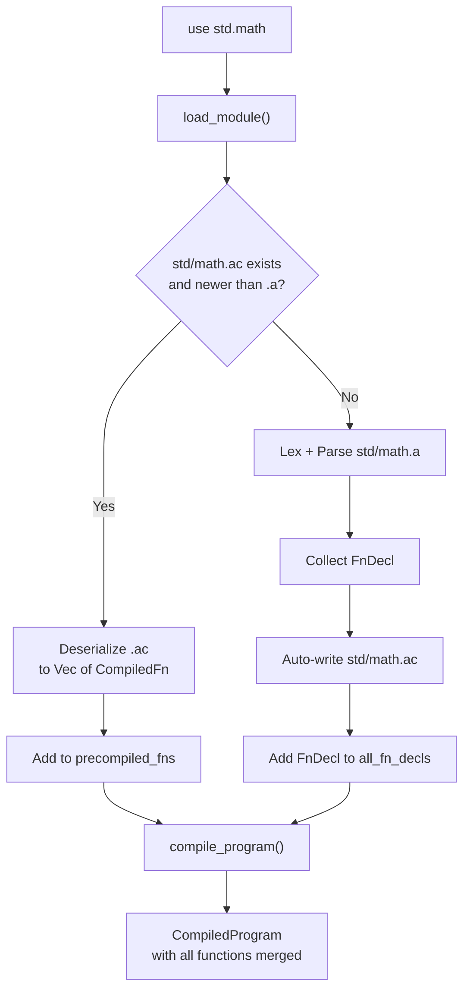

# v0.36 -- Module Precompilation Cache

When `use std.math` is encountered, check for `std/math.ac` alongside `std/math.a`. If the .ac exists and is newer than the .a source, deserialize the pre-compiled functions directly -- skipping lex, parse, and compile entirely. If no cache exists or the source is newer, compile from source as today and auto-write the .ac cache for next time.

This is the same pattern as Python's `.pyc` files. It exercises the .ac serialization pipeline in real everyday use and makes programs with many imports measurably faster.

## Why this works cleanly

From the codebase exploration:

- `CompiledProgram.functions` is a **flat** `Vec<CompiledFn>` -- all imported module functions are already merged in
- Function calls use `Op::Call(name_string_idx, nargs)` -- the VM resolves by **name** at runtime, not by index
- Each `CompiledFn` has its own self-contained `Chunk` (constants, strings, opcodes)
- Pre-compiled functions can be freely appended to the program without index fixups

## Architecture



## Changes to [src/compiler.rs](src/compiler.rs)

### 1. New field on Compiler

```rust
pub struct Compiler {
    // ... existing fields ...
    precompiled_fns: Vec<CompiledFn>,
}
```

### 2. Modified `load_module` -- cache check before lex+parse

After resolving `file_path` and the deduplication check (`loaded_modules`), before `read_to_string`:

- Compute `ac_path`: same as `file_path` but with `.ac` extension
- If `ac_path` exists and `ac_path.metadata().modified() >= file_path.metadata().modified()`:
  - Read and deserialize via `bridge::value_to_program`
  - For each `CompiledFn` in the deserialized program:
    - Push a namespaced copy (`namespace.name`) and a plain copy to `self.precompiled_fns`
  - Process nested `use` declarations stored in a metadata field (see below)
  - Return early (skip lex+parse)
- Otherwise: proceed with current lex+parse+collect logic

### 3. Auto-write .ac after compiling a module

After successfully lexing and parsing a module in `load_module`, we need to also compile it and cache:

- Compile the module's functions with a temporary `Compiler` instance
- Serialize via `bridge::program_to_value` + `serde_json`
- Write to `ac_path`
- Continue with the existing `FnDecl` collection flow

**Note:** This means each cached .ac contains just the functions from that one module (not its transitive deps). Transitive `use` declarations are handled by the dedup set -- when loading `std/compiler/compiler.a` which `use`s `std/compiler/lexer.a`, each module gets its own .ac independently.

### 4. Merge in `compile_program`

After compiling all collected `FnDecl` into `functions`, append `self.precompiled_fns`:

```rust
// at the end of compile_program, before returning
functions.extend(self.precompiled_fns.drain(..));
```

## Changes to [src/bridge.rs](src/bridge.rs) (minor)

The existing `program_to_value` / `value_to_program` already handle serialization. No changes needed for the core format. Optionally add a `"uses"` metadata field to the .ac format so cached modules can declare their own `use` dependencies without re-parsing source.

## Test plan

- **`tests/test_cache.a`**: test suite that exercises module loading (already implicitly tested by all tests that `use std.testing`)
- **Manual verification**: run `a run examples/import_demo.a`, verify .ac files appear alongside std modules, run again and confirm faster load
- **Freshness**: modify a .a file, verify .ac is regenerated
- **All existing tests pass**: no regressions

## Estimated scale

- `src/compiler.rs`: ~40 lines modified/added (cache check, auto-write, merge)
- `src/bridge.rs`: ~5 lines (optional `uses` metadata)
- Test verification: run existing suite
- Total: ~50 lines of Rust changes
