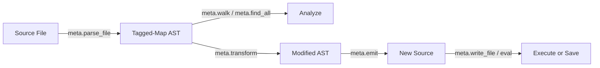

# v0.38 -- Metaprogramming Toolkit (`std/meta.a`)

## Why this matters

The v0.37 emitter closed the metaprogramming loop: `parse -> transform -> emit -> eval`. But using it today requires manually wiring together the parser, AST builders, and emitter every time. Common patterns (walk all nodes, find functions, inject code, rename symbols) have no library support.

`std/meta.a` provides the high-level API that makes programmatic code manipulation trivial. This is what makes "a" a language that can evolve itself -- an AI agent can use these tools to generate, refactor, and transform code structurally instead of through fragile string manipulation.



## The module: `std/meta.a`

Imports [std/compiler/parser.a](std/compiler/parser.a), [std/compiler/emitter.a](std/compiler/emitter.a), and [std/compiler/ast.a](std/compiler/ast.a). All functions are pure "a" -- no Rust changes.

### Core API

**Parsing and Emitting (convenience wrappers)**
- `meta.parse(source)` -- parse source string to Program AST (wraps `parser.parse`)
- `meta.parse_file(path)` -- read file + parse to AST
- `meta.emit(ast)` -- emit AST to source string (wraps `emitter.emit`)
- `meta.emit_to_file(ast, path)` -- emit + write to file

**AST Walking**
- `meta.walk(ast, visitor_fn)` -- depth-first walk of all AST nodes; calls `visitor_fn(node)` on every tagged map. Returns void (side-effect only, for accumulation via closures)
- `meta.find_all(ast, pred_fn)` -- walk AST, collect all nodes where `pred_fn(node)` is truthy. Returns array of matching nodes
- `meta.find_fns(ast)` -- shorthand: find all FnDecl nodes. Returns array of FnDecl maps
- `meta.find_calls(ast)` -- shorthand: find all Call expression nodes

**AST Analysis**
- `meta.fn_names(ast)` -- extract all function names as `[str]`
- `meta.fn_signatures(ast)` -- extract function metadata: `[#{"name": str, "params": [str], "has_return": bool}]`
- `meta.uses(ast)` -- extract all `use` declaration paths as `[[str]]`
- `meta.call_graph(ast)` -- map of function name to array of called function names

**AST Transformation**
- `meta.transform(source, transform_fn)` -- parse source, apply `transform_fn(ast) -> ast`, emit back to source string
- `meta.transform_file(path, transform_fn)` -- read file, transform, write back
- `meta.map_items(ast, map_fn)` -- apply `map_fn` to each top-level item, return new Program AST
- `meta.filter_items(ast, pred_fn)` -- keep only items where `pred_fn(item)` is truthy
- `meta.add_items(ast, new_items)` -- append new top-level items (FnDecl, UseDecl, etc.) to program
- `meta.inject_stmt(fn_node, position, stmt)` -- insert a statement at `"start"` or `"end"` of a function body

**Code Generation Helpers**
- `meta.gen_fn(name, param_names, body_stmts)` -- shorthand to build a FnDecl AST node with inferred types
- `meta.gen_test(name, body_stmts)` -- shorthand to build a `test_*` function
- `meta.gen_call(fn_name, args)` -- shorthand to build a Call expression

## Implementation notes

- **`walk` strategy**: check `type_of(node) == "map"` and `node["tag"]` exists, then recurse into array/map fields. For arrays, walk each element. This naturally covers the full AST tree without needing to enumerate all 66 tags.
- **Closures for accumulation**: `find_all` uses `walk` with a closure that captures a mutable results array -- leveraging v0.21 closure captures.
- **`call_graph`**: uses `find_fns` + per-function `find_calls` to build the adjacency map.
- **`inject_stmt`**: clones the function's body block, inserts the statement at index 0 or appends, returns a new FnDecl with the modified body.

## Demonstration: `examples/gen_tests.a`

A practical tool that reads any `.a` source file and generates a test skeleton:

```
a run examples/gen_tests.a -- examples/math.a
```

Output (written to stdout or a file):
```
use std.testing

fn test_square() {
  ; TODO: test square(x: i64) -> i64
}

fn test_add() {
  ; TODO: test add(a: i64, b: i64) -> i64
}

fn test_distance() {
  ; TODO: test distance(x1: f64, y1: f64, x2: f64, y2: f64) -> f64
}
```

The tool:
1. `meta.parse_file(path)` to get the AST
2. `meta.fn_signatures(ast)` to extract function metadata
3. Filter out `main` and `test_*` functions
4. For each remaining function, `meta.gen_test(...)` to build a test stub
5. `meta.emit(program)` to produce the output

## Test suite: `tests/test_meta.a`

- **Walk tests**: walk a simple AST, count nodes, verify visitor called on all tagged maps
- **Find tests**: find_all with tag predicates, find_fns, find_calls
- **Analysis tests**: fn_names, fn_signatures, uses, call_graph on real parsed files
- **Transform tests**: transform source (e.g., rename a function), verify output parses and executes correctly
- **Generation tests**: gen_fn, gen_test, gen_call produce valid ASTs that emit to compilable source
- **Roundtrip tests**: parse real files -> add instrumentation via inject_stmt -> emit -> eval

## Changes to PLANNING.md

Add v0.38 milestone entry.

## Estimated scale

- `std/meta.a`: ~300-400 lines (walker + analysis + transform + generation helpers)
- `examples/gen_tests.a`: ~60-80 lines
- `tests/test_meta.a`: ~150-200 lines
- `PLANNING.md`: milestone entry
