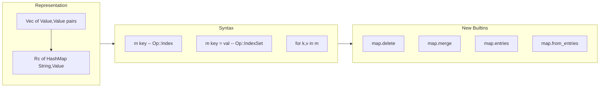

# First-Class HashMap Maps (v0.26)

## The Problem

Maps are the most common data structure for real-world programming (JSON, configs, API payloads, data processing), but in "a" they are:
- **O(n) association lists** -- `Value::Map(Vec<(Value, Value)>)`
- **No bracket indexing** -- `map.get(m, "key")` instead of `m["key"]`
- **No bracket mutation** -- `map.set(m, "key", val)` instead of `m["key"] = val`
- **Not iterable** -- no `for [k, v] in m`
- **Missing operations** -- no delete, merge, entries

## Design

## Phase 1: Representation change

In [src/interpreter.rs](src/interpreter.rs):
- Change `Value::Map(Vec<(Value, Value)>)` to `Value::Map(Rc<HashMap<String, Value>>)`
- Add `pub fn map(m: HashMap<String, Value>) -> Value` helper constructor
- Update `PartialEq` for the new type
- Update `val_to_string` display to show `#{ "key": val, ... }`
- Update `MapLiteral` evaluation: evaluate key expressions, convert to string via `val_to_string`, insert into HashMap
- Update `Serialize` / serde if needed for JSON output

Key decision: **string keys only**. This covers all JSON, config, API, and data processing use cases. Non-string key expressions in map literals are auto-converted to strings. This enables standard `HashMap<String, Value>` with O(1) operations and no custom Hash impl.

## Phase 2: Map indexing (read)

In [src/interpreter.rs](src/interpreter.rs) `eval_expr` for `ExprKind::Index`:
- Add match arm: `(Value::Map(m), Value::String(k))` -> `m.get(k.as_str()).cloned().unwrap_or(Value::Void)`

In [src/vm.rs](src/vm.rs) `Op::Index` handler (~line 404):
- Add match arm: `(Value::Map(m), Value::String(k))` -> push `m.get(k.as_str()).cloned().unwrap_or(Value::Void)`

## Phase 3: Map indexing (write)

In [src/interpreter.rs](src/interpreter.rs) `assign_target`:
- Extend to handle `ExprKind::Index { expr, index }` targets: evaluate expr to get map, evaluate index to get key string, clone-on-write insert into HashMap, update the variable in scope

In [src/vm.rs](src/vm.rs) `Op::IndexSet` handler (~line 420):
- Add match arm for `(Value::Map(m), Value::String(k))`: COW via `Rc::try_unwrap`, insert key-value pair, push updated map. Then `SetLocal` to update the variable (compiler already emits this for index assignment)

## Phase 4: Map iteration

In [src/vm.rs](src/vm.rs) for-loop handling:
- The compiler compiles `for x in collection { body }` using `len(collection)` and `collection[index]`. Currently `len` and `Op::Index` with int don't work for maps.
- Add `len` support for maps in `try_vm_builtin` (already exists in builtins.rs)
- In `Op::Index`: when collection is `Value::Map` and index is `Value::Int(i)`, return the i-th entry as `Value::Array([key_string, value])` -- this makes `for [k, v] in map` work via the existing destructuring from v0.24

In [src/interpreter.rs](src/interpreter.rs):
- Same approach: `Index` on `(Map, Int)` yields the i-th entry as `[key, value]` array

## Phase 5: VM and builtins update

In [src/vm.rs](src/vm.rs) `try_vm_builtin`:
- Update `map.get`, `map.set`, `map.keys`, `map.values`, `map.has` for HashMap
- Add `map.delete(m, key)` -- remove key, return new map
- Add `map.merge(m1, m2)` -- merge m2 into m1, return new map
- Add `map.entries(m)` -- return `[[k1,v1], [k2,v2], ...]` array
- Add `map.from_entries(arr)` -- build map from `[[k,v], ...]` array
- Update `Op::MapNew` to build HashMap from stack pairs (converting keys to strings)

In [src/builtins.rs](src/builtins.rs):
- Mirror all changes for the tree-walker interpreter path
- Register new names in `is_builtin`

In [src/vm.rs](src/vm.rs) `Op::Field`:
- Simplify: `Value::Map(m)` + field name -> `m.get(name)` (direct HashMap lookup instead of linear scan)

In [src/vm.rs](src/vm.rs) `val_display`:
- Update for `Rc<HashMap<String, Value>>`

## Phase 6: Type checker

In [src/checker.rs](src/checker.rs):
- Update `ExprKind::Index` check: if inner type is `Map(K, V)`, return `V` (or `Unknown`)
- `MapLiteral` check already works (returns `Type::Map(K, V)`)

## Phase 7: Formatter

In [src/formatter.rs](src/formatter.rs):
- `MapLiteral` formatting should already work since it's expression-based, but verify

## Phase 8: Tests

- Integration tests for map indexing read: `m["key"]` returns correct value
- Integration tests for map indexing write: `m["key"] = val` mutates correctly
- Integration tests for map iteration: `for [k, v] in m` yields all entries
- Integration tests for new builtins: delete, merge, entries, from_entries
- Integration tests for map + pipe chains: `map.entries(m) |> filter(...) |> map.from_entries`
- Native `.a` test file: `tests/test_maps.a`
- Verify all existing tests still pass (map.get/set/keys/values/has backward compat)

## Phase 9: PLANNING.md

Add v0.26 milestone with feature summary and test counts.
