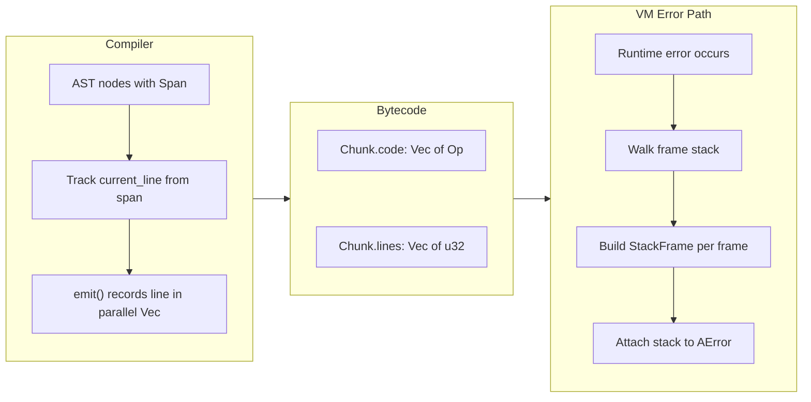

# Source-Mapped Stack Traces (v0.25)

## The Problem

Every `AError::runtime(...)` in the VM passes `None` for the span. `CallFrame` is just `{ fn_idx, ip, stack_base }` -- no source location. The AST has `Span { line, col, offset, len }` on every `Expr`, `Stmt`, and `TopLevel` node, but the compiler discards all of it when emitting bytecode.

## Design



## Phase 1: Line table in bytecode

In [src/bytecode.rs](src/bytecode.rs):
- Add `pub lines: Vec<u32>` to `Chunk` (parallel to `code`, one line number per opcode)
- Modify `emit()` to also push the current line: add a `current_line: u32` field to `Chunk`, and `emit()` does `self.lines.push(self.current_line)`
- Add `pub fn set_line(&mut self, line: u32)` to update `current_line`
- Initialize both in `Chunk::new()`

## Phase 2: Compiler line propagation

In [src/compiler.rs](src/compiler.rs):
- At the top of `compile_stmt()`: if `stmt.span` is `Some(span)`, call `chunk.set_line(span.line as u32)`
- At the top of `compile_expr()`: if `expr.span` is `Some(span)`, call `chunk.set_line(span.line as u32)`
- This naturally propagates line info to every opcode emitted during that node's compilation

## Phase 3: Stack trace in errors

In [src/errors.rs](src/errors.rs):
- Add a `StackFrame` struct: `{ function: String, line: u32 }`
- Add `pub stack: Vec<StackFrame>` to `AError` (serialized to JSON, empty by default)
- Add builder method: `pub fn with_stack(mut self, stack: Vec<StackFrame>) -> Self`

## Phase 4: VM stack trace capture

In [src/vm.rs](src/vm.rs):
- Add a helper `fn capture_stack_trace(&self) -> Vec<StackFrame>` that walks `self.frames` and for each frame reads:
  - `function` from `self.program.functions[frame.fn_idx].name`
  - `line` from `self.program.functions[frame.fn_idx].chunk.lines[frame.ip.saturating_sub(1)]`
- At every point where a runtime error is created or propagated (in `do_call`, `execute_loop`, `try_vm_builtin`, `do_hof`), attach the stack trace via `.with_stack(self.capture_stack_trace())`
- Also set `span` on the error from the current frame's line info

## Phase 5: CLI formatting

In [src/main.rs](src/main.rs):
- When printing a `RuntimeError` that has a non-empty `stack`, format human-readable output to stderr before the JSON:
  ```
  RuntimeError: index out of bounds
    at process_line (line 42)
    at main (line 105)
  ```
- JSON output continues to work as before, now with a populated `"stack"` field

## Phase 6: Tests

- Add integration tests that verify stack traces contain correct function names and line numbers
- Test nested calls (A calls B calls C, error in C should show all three)
- Test that tail-call-optimized frames are correctly reported
- Test that builtin errors include the calling function's location
- Verify existing tests still pass (JSON output now has extra `"stack":[]` field)

## Bonus: `assert` with location

- `std/testing.a` assertions (`assert_eq`, `assert_true`, etc.) call `fail(msg)` which becomes a RuntimeError -- these will now automatically get stack traces showing which test function and line the assertion failed at
