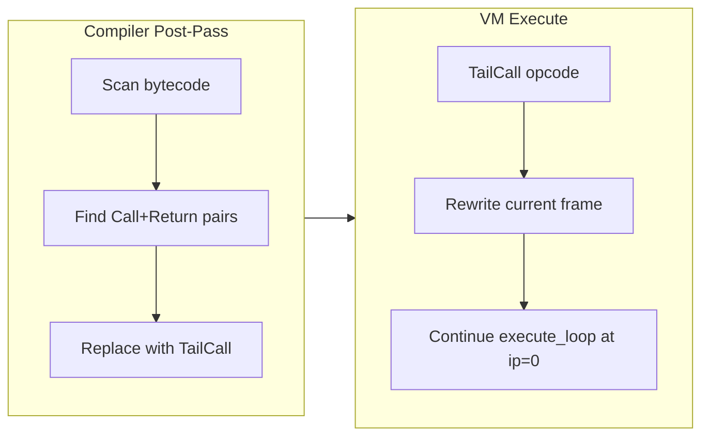

# Tail Call Optimization

## Design

A **peephole optimization** in the compiler + two new opcodes in the VM. The compiler detects `Call` or `CallClosure` immediately followed by `Return` and fuses them into a single `TailCall` / `TailCallClosure` opcode. The VM handles these by rewriting the current frame in-place instead of pushing a new one.



## Phase 1: New opcodes

In [src/bytecode.rs](src/bytecode.rs):
- Add `TailCall(usize, usize)` -- same shape as `Call(name_idx, nargs)`
- Add `TailCallClosure(usize)` -- same shape as `CallClosure(nargs)`

## Phase 2: Compiler peephole pass

In [src/compiler.rs](src/compiler.rs), add a `fn optimize_tail_calls(chunk: &mut Chunk)` post-pass called at the end of `compile_fn`:

- Scan `chunk.code` for the pattern `Call(name_idx, nargs)` at index `i` followed by `Return` at index `i+1`
- Replace `code[i]` with `TailCall(name_idx, nargs)` and `code[i+1]` with `Pop` (or a NOP -- but `Pop` is safe since it's unreachable)
- Same for `CallClosure(nargs)` followed by `Return` -> `TailCallClosure(nargs)`
- Also handle `CallMethod(m, f, n)` followed by `Return` -> `TailCallMethod(m, f, n)` (or route through the same mechanism)

Note: this naturally handles both self-recursion and mutual recursion.

## Phase 3: VM execution

In [src/vm.rs](src/vm.rs), add a handler for `TailCall(name_idx, nargs)`:

```rust
Op::TailCall(name_idx, nargs) => {
    let name = chunk.strings[name_idx].clone();
    // Try builtins first (they don't recurse, just return a value)
    // ... same builtin checks as do_call ...
    // For user functions: rewrite frame in-place
    if let Some(fi) = self.find_function(&name) {
        let frame = self.frames.last_mut().unwrap();
        let old_base = frame.stack_base;
        // Copy args from top-of-stack to old_base
        let arg_start = self.stack.len() - nargs;
        for i in 0..nargs {
            self.stack[old_base + i] = self.stack[arg_start + i].clone();
        }
        // Truncate and pad for new function's locals
        let num_locals = self.program.functions[fi].locals.len();
        self.stack.truncate(old_base + nargs);
        while self.stack.len() < old_base + num_locals {
            self.stack.push(Value::Void);
        }
        frame.fn_idx = fi;
        frame.ip = 0;
        continue; // restart execute_loop iteration
    }
    // Fallback: non-tail (shouldn't happen for user fns)
}
```

For `TailCallClosure(nargs)`: pop the closure value, if `VMClosure` prepend captures as extra args, then do the same frame rewrite. If it's a plain `String` function name, same treatment.

Key correctness concern: builtins called in tail position should NOT do frame rewriting -- they just return a value normally. The peephole is safe here because `do_call` for builtins doesn't push a frame, so the `Return` after a builtin call is still needed. The compiler should only emit `TailCall` when the call target is **not** a known builtin. Alternatively, the VM handler can check: if the name resolves to a builtin, fall through to the normal call+return path.

Simplest approach: in the VM, if `TailCall` resolves to a builtin, just do `do_call` normally and let the next opcode (which is now unreachable `Pop`) be skipped by the `Return` that `do_call` doesn't consume. Actually, even simpler: just call `do_call` for builtins and then the function returns the value to the stack; we need a `Return` to complete the frame. So for builtins, we should fall back to regular `Call` behavior. The cleanest way: attempt frame rewrite only when `find_function` succeeds; otherwise delegate to `do_call` and keep the `Return` by not replacing it.

**Revised approach**: In the peephole, replace `Call+Return` with `TailCall` and remove the `Return` (replace with a no-op `Pop` that's unreachable). In the VM, `TailCall` first checks if it's a user function; if yes, rewrite frame. If it resolves to a builtin, call it normally, push its result, then **execute a return** (pop frame, truncate, push result) inline.

## Phase 4: Tests

- Add a `vm_tail_recursion_deep` test: `fn countdown(n) { if n == 0 { ret 0 } ret countdown(n - 1) }` with n = 100,000
- Add a `vm_tail_mutual_recursion` test: `fn is_even(n) { if n == 0 { ret true } ret is_odd(n-1) }` / `fn is_odd(n) { if n == 0 { ret false } ret is_even(n-1) }`
- Add a `vm_tail_call_closure` test: tail-calling a local closure variable
- Add a `vm_tail_accumulator` test: `fn sum(n, acc) { if n == 0 { ret acc } ret sum(n-1, acc+n) }` with large n
- Verify existing tests still pass (no regression from peephole)
- Add native `.a` test file `tests/test_tco.a`

## Phase 5: Update PLANNING.md

Add v0.23 milestone.

## Bonus: math builtins

While touching builtins, add `floor`, `ceil`, `round` -- trivial 3-line additions to both `builtins.rs` and `vm.rs`, commonly needed for numeric processing.
