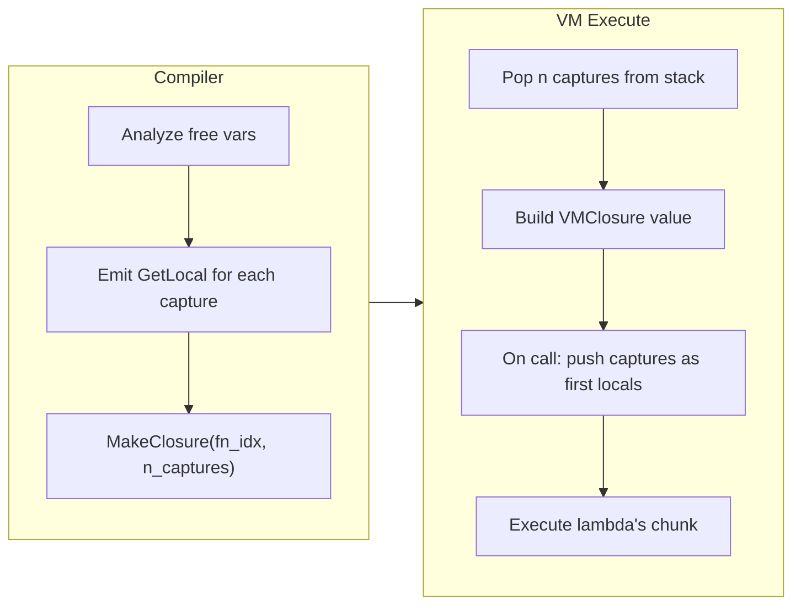

# VM Closure Captures

## The Problem

Lambdas in "a" are compiled by lifting them to top-level functions named `__lambda_N`. The `MakeClosure` opcode just pushes the function's string name onto the stack. When the lambda body references a variable from an enclosing scope, it compiles to `GetGlobal` (which returns `Void`) because the variable isn't in the lambda's own locals. The tree-walker interpreter handles this correctly by snapshotting the scope chain into `Value::Closure { env }`, but the VM has no equivalent.

```586:609:src/compiler.rs
// Current: lambda becomes a bare FnDecl with no capture info
ExprKind::Lambda { params, body } => {
    self.lambda_counter += 1;
    let name = format!("__lambda_{}", self.lambda_counter);
    // ... creates FnDecl, pushes MakeClosure with string name
}
```

```250:261:src/vm.rs
// Current: CallClosure for non-String values just pushes Void
Value::Closure { .. } | _ => {
    let start = self.stack.len() - nargs;
    self.stack.drain(start..);
    self.stack.push(Value::Void);
}
```

## Design: Flat Closures

Use a **flat closure** model (like Lua/Python bytecode VMs): at `MakeClosure` time, copy the current values of captured variables into a new `Value::VMClosure` value. When calling, those captured values become extra locals in the callee's frame.

This avoids upvalue cells and shared mutability -- simpler, fits "a"'s value semantics, and is fast with `Rc<String>`/`Rc<Vec>`.



## Implementation

### Phase 1: Capture analysis in the compiler

In [src/compiler.rs](src/compiler.rs), when compiling `ExprKind::Lambda`:

- Before creating the `FnDecl`, walk the lambda body's AST to collect **free variables** -- identifiers that are not in the lambda's own params and not known builtins/functions.
- Resolve each free variable against the *current* compiler's `locals` list. If found, it's a capture.
- Add each capture name as an **extra parameter** prepended to the lambda's param list (the compiler already handles params as the first locals).
- Before emitting `MakeClosure`, emit `GetLocal` for each captured variable (pushes their current values onto the stack).

### Phase 2: New opcode and Value variant

In [src/bytecode.rs](src/bytecode.rs):
- Change `MakeClosure(usize)` to `MakeClosure(usize, usize)` -- `(const_idx_of_name, n_captures)`. Since `Op` is `Copy`, this is still two `usize` values.

In [src/interpreter.rs](src/interpreter.rs) (Value definition):
- Add a `VMClosure` variant: `VMClosure { name: Rc<String>, captures: Rc<Vec<Value>> }` -- lightweight, cloneable.

### Phase 3: VM execution

In [src/vm.rs](src/vm.rs):

- **`MakeClosure`**: Pop `n_captures` values from the stack, read the function name from constants, push `Value::VMClosure { name, captures }`.
- **`CallClosure`**: When the callee is `Value::VMClosure { name, captures }`, push the captures onto the stack as the first locals (before the explicit arguments), then `do_call(&name, nargs + captures.len())`.
- **`call_value`** (used by HOFs): Same treatment for `VMClosure`.

### Phase 4: Free variable analysis

Add a function `fn free_vars(body: &Expr, params: &[Param]) -> Vec<String>` that walks the AST:
- Collects all `ExprKind::Ident(name)` references
- Subtracts the lambda's own params, any `let`-bound names within the body, and known builtins/globals
- Returns the list of names that must be captured

This can live in the compiler module. It doesn't need to be perfect -- if a name isn't found in the enclosing locals, it simply won't be captured (falls through to `GetGlobal` as today).

### Phase 5: Tests

- Add integration tests that exercise captures: `let x = 10; let f = |y| y + x; assert f(5) == 15`
- Test nested captures: `let a = 1; let f = |x| { let g = |y| y + a + x; g(2) }; assert f(3) == 6`
- Test captures in HOFs: `let offset = 5; let result = map([1,2,3], |x| x + offset); assert result == [6,7,8]`
- Test captures with mutation: `let items = []; ... map(..., |x| push(items, x))` (value semantics -- captures are snapshots)
- Run all existing tests to ensure no regression

### Expected outcome

After this change, code like the following works on the VM fast path:

```
fn main() -> void effects [io] {
  let data = [1, 2, 3, 4, 5]
  let threshold = 3
  let result = data
    |> filter(|x| x > threshold)
    |> map(|x| x * 2)
  println(to_str(result))
}
```

Output: `[8, 10]`
