# VM Performance Overhaul

The profiling reveals five dominant costs, ordered by impact:

## Bottleneck Analysis

```mermaid
flowchart LR
    subgraph hot_loop [Execute Loop]
        OpClone["Op clone per instruction"]
        FrameLookup["frames.last() x2"]
    end
    subgraph calls [Function Calls]
        StringCmp["Sequential if name == checks"]
        FindFn["Linear find_function O(n)"]
        DummyInterp["Interpreter::new() per builtin"]
        MethodAlloc["format! for CallMethod"]
    end
    subgraph values [Value Overhead]
        DeepClone["Value::clone is deep copy"]
        PushClone["push clones entire array"]
        CharsAlloc["str.chars: 1 String per char"]
        OpStringClone["Op::Call owns String"]
    end
    hot_loop --> calls --> values
```

**1. Op clone every instruction** -- `chunk.code[ip].clone()` runs on EVERY instruction. Opcodes like `Call(String, usize)` allocate a new String each time they execute. This is the single biggest cost.

**2. push() clones the entire array** -- `arr.clone()` then `.push()`. For the lexer building a 2000-element token array, this is O(n^2) total allocations. This is why the self-interpreter is so slow.

**3. str.chars allocates one String per character** -- A 100-char string produces 100 heap allocations. The lexer calls this on every source file.

**4. Function dispatch is linear** -- `do_call` does sequential `if name == "..."` checks, then `find_function` does a linear scan of all compiled functions. Also creates a dummy `Interpreter::new()` for every builtin call.

**5. Value::clone is deep** -- No Rc/Arc sharing. Cloning an array clones every element recursively.

## Plan

### Phase 1: Zero-copy opcode dispatch

Change `Op` to use `&str` references or indices instead of owned Strings, and borrow the opcode from the chunk instead of cloning it.

- In [src/bytecode.rs](src/bytecode.rs): Change `Call(String, usize)` to `Call(usize, usize)` where the first usize is an index into a string intern table (`Chunk::strings: Vec<String>`)
- Same for `CallMethod`, `GetGlobal`, `SetGlobal`, `Field`, `MakeClosure`, `MatchVariant`
- In [src/vm.rs](src/vm.rs) `execute_loop`: Replace `chunk.code[ip].clone()` with `&chunk.code[ip]` (borrow instead of clone). This requires the match arms to not hold `&mut self` borrows simultaneously -- use index-based access patterns

### Phase 2: Mutable push (the biggest algorithmic win)

- In [src/vm.rs](src/vm.rs) `do_call`: Intercept `push` directly in the VM. Instead of going through `builtins::call_builtin` which clones the array, pop the array from the stack, push the element in-place (`if let Value::Array(mut arr) = ...`), and push it back. This turns O(n) clone into O(1) amortized
- Same for `sort`, `reverse_arr`, `contains` -- intercept in VM to avoid the clone through builtins

### Phase 3: Function dispatch table

- In [src/vm.rs](src/vm.rs): Replace `find_function` linear scan with a `HashMap<String, usize>` built once at VM creation
- In `do_call`: Replace sequential `if name == "..."` builtin checks with a pre-built `HashMap<&str, fn(...)>` or at minimum a match statement instead of if-chain
- Remove `Interpreter::new()` allocation per builtin call -- pass a minimal context or make builtins standalone functions

### Phase 4: Rc-wrapped strings and arrays (optional, high impact)

- In [src/interpreter.rs](src/interpreter.rs): Change `Value::String(String)` to `Value::String(Rc<String>)` and `Value::Array(Vec<Value>)` to `Value::Array(Rc<RefCell<Vec<Value>>>)` (or `Rc<Vec<Value>>` for immutable sharing)
- This makes `Value::clone()` for strings and arrays O(1) reference count bump instead of deep copy
- Biggest impact on: local variable reads (`GetLocal` clones), `Dup`, passing arrays to functions

### Expected impact

| Optimization | Estimated speedup | Effort |
|---|---|---|
| Phase 1: Zero-copy dispatch | 2-3x on call-heavy code | Medium |
| Phase 2: Mutable push | 10-100x on array-building loops | Low |
| Phase 3: Dispatch table | 2-3x on builtin-heavy code | Low |
| Phase 4: Rc values | 2-5x across the board | High |

Phase 2 alone should make the bootstrap proof run in under a minute instead of 6 minutes. Phases 1-3 combined should get 10-20x overall. Phase 4 is the most invasive but completes the picture.

I propose doing **Phases 2 and 3 first** (highest impact-to-effort ratio), then Phase 1, then Phase 4 if needed.
