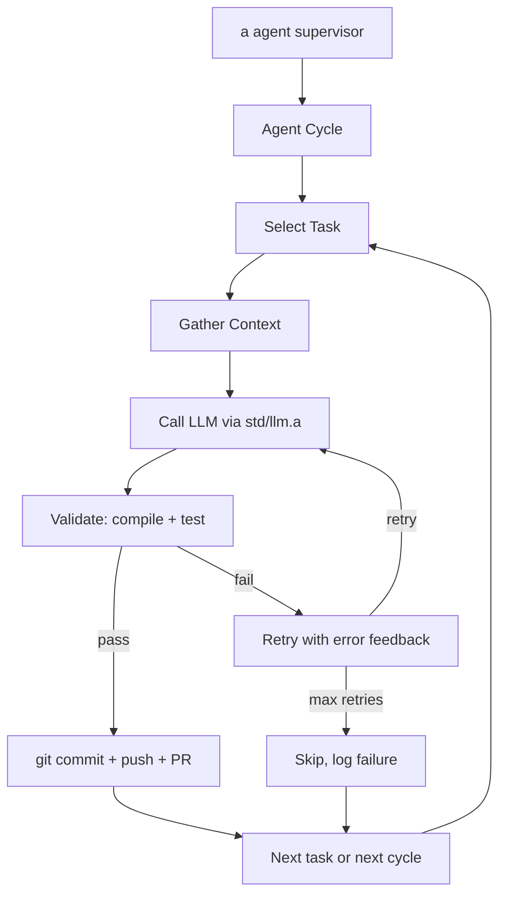

# LLM-Powered Self-Improvement Agent

## Why the Current Agent Fails

The log shows 3 identical runs, each processing 61 modules with **0 improvements and 0 tests generated**:

- **28 modules profiled** -- none had hot functions meeting the narrow inlining criteria (small body + high call count)
- **33 modules with no tests** -- the mechanical `testgen.gen_tests()` fails to produce compilable code for every single one
- The agent is deterministic, so it will produce the same null result forever

The heuristic optimizer is a dead end. The code needs intelligence, not pattern matching.

## What Already Exists in `a`

The language already has everything needed for an LLM-powered agent:

- **[std/llm.a](std/llm.a)** -- OpenAI/Anthropic/Google API client with tool calling, streaming, retries. Supports custom `base_url`, which means it works with any OpenAI-compatible API including **Ollama**.
- **[std/codegen.a](std/codegen.a)** -- `compile_check()`, `run_in_sandbox()`, `test()`, and `generate()` (already uses `llm.chat`)
- **[std/index.a](std/index.a)** -- Codebase intelligence: symbols, call graphs, dependencies
- **[std/fs_tx.a](std/fs_tx.a)** -- Transactional file ops with automatic rollback
- **[std/git.a](std/git.a)** -- Structured git operations (branch, commit, push, PR)
- **[std/agent.a](std/agent.a)** -- Supervisor, checkpointing, self-update

## LLM Backend: Ollama + Qwen3.6-35B-A3B (local, free)

**Hardware** (verified): Intel Core Ultra 7 155H (16C/22T), 93GB RAM (84GB free), 222GB disk. No NVIDIA GPU -- CPU inference only.

**Model choice**: Qwen3.6-35B-A3B -- released April 16, 2026 (today). 35B total params, only 3B active per token (MoE). 73.4% SWE-bench Verified (autonomous real-world bug fixing). 51.5 Terminal-Bench 2.0 (agentic terminal coding). 256K context. 24GB on Ollama. Apache 2.0 license.

**Why this model**: Purpose-built for agentic coding and repository-level reasoning. Native tool calling and thinking mode. The SWE-bench score means it successfully fixes 3/4 of real GitHub issues autonomously -- directly relevant to self-improving a codebase. At 24GB it leaves 69GB free for the OS, build tools, and compilation pipeline.

**Why Ollama**: Handles model downloading, chat templates per-model, memory management, and exposes an OpenAI-compatible API at `http://localhost:11434/v1/chat/completions`. The `std/llm.a` module works with this out of the box via the `provider: "openai"` + `base_url` options.

**Setup**:

```bash
curl -fsSL https://ollama.com/install.sh | sh
ollama pull qwen3.6
```

**Integration**: The agent calls `llm.chat("openai", "qwen3.6", messages, #{"base_url": "http://localhost:11434/v1/chat/completions", "api_key": "ollama"})`. No cloud API key needed.

**Expected performance**: MoE with 3B active params is fast on CPU. Expect 10-20 tokens/sec. A test file (150 lines) generates in 1-2 minutes. One full cycle (process one module: generate, validate, retry, commit) takes 5-10 minutes. Perfectly acceptable for a background agent.

## Architecture




Each cycle, the agent:

1. **Selects a task** from a prioritized queue (test generation first, then improvements)
2. **Gathers context** -- reads the module source, existing tests, example test files for format reference
3. **Calls the LLM** with a focused prompt containing the module source and language conventions
4. **Validates** the output: `codegen.compile_check()` then actually runs the test/code
5. **Retries** if validation fails, feeding the error back to the LLM (up to 3 attempts)
6. **Commits** validated changes with descriptive messages, pushes branch, opens PR

## Task Priority

1. **Write missing tests** (33 modules) -- biggest gap, highest value. Tests make all future improvements safer.
2. **Improve untested code paths** -- once tests exist, improve error handling, edge cases, robustness.
3. **Optimize hot paths** -- profile-guided, but with LLM suggesting the optimization strategy instead of mechanical inlining.
4. **Structural improvements** -- refactoring, dead code removal, better abstractions.

## Implementation: `agents/self_improve_ai.a`

Replace [agents/self_improve.a](agents/self_improve.a) with an LLM-powered version. Key design decisions:

**Prompt engineering**: Each task type has a prompt template. For test generation:

- System prompt: `a` language syntax reference + testing conventions + available builtins
- User prompt: full module source + 2 example test files for format reference + specific instructions
- The existing `codegen._build_system_prompt()` is a starting point but needs enrichment with test format conventions and richer language reference

**Validation pipeline**: Generated code must pass:

1. `codegen.compile_check()` -- parse + static analysis
2. Actual compilation via `exec(cli + " build " + file)` -- catches codegen-level errors
3. Actual execution -- tests must exit 0

**Retry with feedback**: On validation failure, send the error message back to the LLM:

- "Your generated test failed to compile with error: X. Here is the code you generated. Fix it."
- Up to 3 retries per task (configurable)

**Rate control** (local model, no cost, but manage throughput):

- Process one module per cycle (not all 61)
- Track token counts for observability
- Sleep between cycles (configurable, default 30s)
- Model: `qwen3.6` via Ollama

**State persistence**: Use `agent.checkpoint()` to track:

- Which modules have been processed
- Which tasks succeeded/failed
- Cumulative token usage
- Run history

**Context window strategy**: For each module, include:

- The module source (most are 50-600 LOC, fits easily)
- 2 example test files (~100-200 lines each)
- Abbreviated language reference (~200 lines)
- Total: well under 10K tokens input per call

## Running

Ensure Ollama is running (`ollama serve` or systemd), then:

```bash
# Test a single cycle
./a agent agents/self_improve_ai.a --name self-improver --no-restart 2>&1 | tee /tmp/self-improve-ai.log

# Continuous operation
./a agent agents/self_improve_ai.a --name self-improver --max-restarts 0
```

No API keys needed. The agent talks to Ollama at `localhost:11434`.

**Fallback**: If local quality is insufficient for some tasks, the agent can be switched to a cloud provider by setting `ANTHROPIC_API_KEY` or `OPENAI_API_KEY` -- no code changes needed, just env vars.

## Safety Guarantees (unchanged from current agent)

- All changes validated: compile + test before commit
- `fs_tx.run()` for automatic rollback on failure
- Each improvement on an isolated git branch (`self-improve/run-N`)
- CI validates every PR (`.github/workflows/ci.yml`)
- Auto-merge only after CI passes (`.github/workflows/auto-merge.yml`)
- Existing test suite must still pass after changes

## Files to Create/Modify

- **Replace**: [agents/self_improve.a](agents/self_improve.a) -- new LLM-powered agent
- **No other files need modification** -- all the infrastructure (`std/llm.a`, `std/codegen.a`, `std/git.a`, `std/fs_tx.a`, `std/agent.a`, CI workflows) already exists

## Current Status & Blockers (2026-04-16)

**What's built**: `agents/self_improve_ai.a` is complete and compiles. It includes:

- Task selection (finds untested modules)
- Rich prompt templates (language reference, test format, examples)
- Validate-retry loop (compile_check -> build -> run, with error feedback)
- Git workflow (branch, commit, push, PR)
- State persistence via `agent.checkpoint()`
- Ollama integration via `exec("curl ...")` (native `/api/chat` endpoint, `stream: false`, `think: false`)

**Blocker: CPU inference too slow for Qwen3.6-35B**. Even with 20 threads on an Intel Core Ultra 7 155H (93GB RAM), a single test-generation call (~2000 token prompt + ~500 token response) takes 5-10+ minutes and frequently times out. The model is 22GB and runs entirely on CPU with no GPU offloading.

Key findings from testing:

- Simple prompts ("Say hello"): ~2 seconds -- works fine
- Full test-generation prompts (~8KB JSON, ~2000 tokens): 5-10+ minutes -- impractical
- `http.post` in the `a` runtime cannot handle streaming responses (hangs forever with `stream: true`)
- Switched to `exec("curl ...")` with `stream: false` as workaround
- Ollama's `num_thread` option requires killing the runner and reloading the model to take effect
- Ollama can only handle 1 request at a time (Parallel:1); stale requests block the queue

**The agent code is ready. It just needs a faster backend.**

## Backend Options (pick one to unblock)

### Option A: Cloud API (fastest to unblock, best quality)

Use a cloud model. The agent already supports this -- just set an env var.


| Provider       | Model            | Cost            | Speed      | Quality                  |
| -------------- | ---------------- | --------------- | ---------- | ------------------------ |
| **Anthropic**  | Claude Sonnet 4  | ~$3/M tokens    | ~80 tok/s  | Best at code             |
| **Google AI**  | Gemini 2.5 Flash | ~$0.15/M tokens | ~150 tok/s | Good, very cheap         |
| **OpenRouter** | Various          | Varies          | Varies     | One API key, many models |


**Estimated cost**: Generating tests for 30 modules ≈ $0.50-2.00 total (most modules are <200 lines).

**How to switch**: Set `LLM_PROVIDER=anthropic` and `ANTHROPIC_API_KEY=sk-...` (or equivalent for other providers). The agent's `_call_llm()` function already has a cloud fallback path through `std/llm.a`.

### Option B: Smaller Local Model (free, runs now on CPU)

Swap Qwen3.6-35B for a model that fits comfortably in CPU inference:


| Model                   | Size  | Speed (est.) | Quality                    |
| ----------------------- | ----- | ------------ | -------------------------- |
| `**qwen2.5-coder:7b`**  | 4.7GB | ~30-50 tok/s | Good for code, well-tested |
| `**qwen2.5-coder:14b**` | 9GB   | ~15-25 tok/s | Better quality, still fast |
| `**qwen3.6:3b**`        | ~2GB  | ~60+ tok/s   | Fast but lower quality     |


**How to switch**: `ollama pull qwen2.5-coder:7b` then set `OLLAMA_MODEL=qwen2.5-coder:7b`.

### Option C: GPU (best local experience, requires purchase)

Your laptop has Thunderbolt 4, so an eGPU enclosure + desktop GPU works. The Qwen3.6-35B model needs 24GB+ VRAM.


| GPU                 | VRAM | Price (approx) | Speed (est.)   | Notes                      |
| ------------------- | ---- | -------------- | -------------- | -------------------------- |
| **RTX 3090 (used)** | 24GB | ~$800          | ~60-80 tok/s   | Best value, fits the model |
| **RTX 4090**        | 24GB | ~$1,600        | ~100-130 tok/s | Fastest consumer card      |
| **RTX 5090**        | 32GB | ~$2,000+       | ~150+ tok/s    | Newest, future-proof       |


You'd also need an eGPU enclosure (~$200-300). There's a ~30% throughput penalty vs desktop PCIe, but still 50-100x faster than CPU inference.

**Alternatively**, a desktop build with a GPU avoids the eGPU penalty. A used workstation + RTX 3090 can be under $1,200 total.

### Recommendation

**Start with Option A (cloud) or Option B (smaller model)** to validate the agent works end-to-end and produces good tests. Once validated, invest in Option C (GPU) if you want fully local + powerful long-term.

## Future Extensions (not in this PR)

- **Tool-use loop**: Give the LLM tools (read_file, write_file, run_tests, search) and let it drive multi-step improvements via `llm.chat()` with `tools` parameter
- **Learning from history**: Analyze which improvements succeeded/failed across cycles to inform task selection
- **Cross-module reasoning**: Use `index.callers()` / `index.dependents()` for impact analysis before changes
- **Meta-self-improvement**: Let the agent modify `agents/self_improve_ai.a` itself

