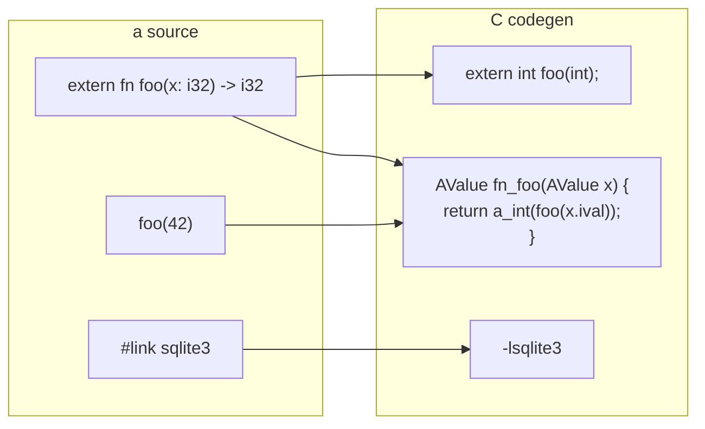

# v0.46 -- C Foreign Function Interface

## Design

An `extern fn` declaration tells the compiler that a function exists in C with specific C types. The code generator emits a **shim wrapper** that marshals `AValue` arguments to C types, calls the raw C function, and wraps the C return value back into an `AValue`. Link flags are passed via `#link` directives at the top of files.

```a
#link "sqlite3"

extern fn sqlite3_open(filename: str, db: ptr) -> i32
extern fn sqlite3_close(db: ptr) -> i32
extern fn sqlite3_exec(db: ptr, sql: str, cb: ptr, data: ptr, err: ptr) -> i32

fn main() {
  let mut db = ptr.null()
  sqlite3_open("test.db", ptr.addr_of(db))
  sqlite3_exec(db, "CREATE TABLE t (id INTEGER)", ptr.null(), ptr.null(), ptr.null())
  sqlite3_close(db)
}
```

## Architecture



The key insight: extern functions get **two** C declarations -- a raw C prototype (`extern int foo(int)`) and an AValue shim (`AValue fn_foo(AValue x) { ... }`). Call sites use the shim, just like any other "a" function. This means the rest of the call resolution system (builtin check, known-fn check, closure fallback) works unchanged.

## FFI Type Mapping

| "a" type | C type | AValue extraction | AValue construction |
|----------|--------|-------------------|---------------------|
| `i32` | `int32_t` | `(int32_t)v.ival` | `a_int(result)` |
| `i64` | `int64_t` | `v.ival` | `a_int(result)` |
| `f64` | `double` | `v.fval` | `a_float(result)` |
| `f32` | `float` | `(float)v.fval` | `a_float(result)` |
| `str` | `const char*` | `v.sval->data` | `a_string(result)` |
| `bool` | `int` | `v.bval` | `a_bool(result)` |
| `ptr` | `void*` | `v.pval` | `a_ptr(result)` |
| `void` | `void` | -- | `a_void()` |

## Changes by Layer

### 1. C Runtime -- `TAG_PTR` and pointer helpers

Add to [c_runtime/runtime.h](c_runtime/runtime.h):
- `TAG_PTR` to the `ATag` enum (value 9)
- `void* pval;` to the `AValue` union
- Declarations: `a_ptr(void*)`, `a_ptr_null()`, `a_ptr_addr_of(AValue*)`, `a_is_null(AValue)`

Add to [c_runtime/runtime.c](c_runtime/runtime.c):
- Constructor implementations
- `a_type_of` case for `TAG_PTR` returning `"ptr"`
- Print/display handling for `TAG_PTR`

### 2. Self-hosted Lexer -- `KwExtern` token

In [std/compiler/lexer.a](std/compiler/lexer.a) `keyword_or_ident` (~line 18-58):
- Add `if word == "extern" { ret "KwExtern" }`

### 3. Self-hosted Parser -- `extern fn` and `#link`

In [std/compiler/parser.a](std/compiler/parser.a):

- `parse_top_level` (~line 80): add `if k == "KwExtern" { ret parse_extern_fn(toks, pos) }` before the error fallback
- New `parse_extern_fn`: consume `KwExtern`, then `KwFn`, name, params (with types -- types are **required** for extern), optional `-> ret_type`, newline. No body.
- `parse_program` (~line 66): before the item loop, scan for `#link` directives (lines starting with `#link "libname"`)

### 4. Self-hosted AST -- `ExternFn` node

In [std/compiler/ast.a](std/compiler/ast.a):
- New `mk_extern_fn(name, params, ret_type)` returning `#{"tag": "ExternFn", "name": name, "params": params, "ret_type": ret_type}`

### 5. C Code Generator -- shim emission

In [std/compiler/cgen.a](std/compiler/cgen.a):

**`emit_program`** (~line 1460):
- Process `ExternFn` items: for each, emit a raw C prototype and an AValue shim wrapper
- Add extern function names to `main_ctx["fns"]` so call resolution treats them as known functions
- Collect `#link` directives and emit them as a comment header (for use by build scripts)

**New `_emit_extern_fn`**: Given an `ExternFn` AST node:
1. Map each param's "a" type to a C type string (e.g., `i32` -> `int32_t`)
2. Emit `extern <c_ret_type> <name>(<c_param_types>);`
3. Emit `AValue fn_<name>(AValue p0, AValue p1, ...) {`
4. For each param, emit extraction: `int32_t __p0 = (int32_t)p0.ival;`
5. Emit call: `<c_ret_type> __result = <name>(__p0, __p1, ...);`
6. Emit return wrapping: `return a_int(__result);`
7. Close `}`

**`_builtin_map`**: Add `"ptr.null": "a_ptr_null"`, `"ptr.addr_of": "a_ptr_addr_of"`, `"ptr.is_null": "a_is_null"` for pointer builtins.

### 6. Rust Lexer/Parser/AST -- parity

To keep the VM able to parse files containing `extern fn`:

- [src/tokens.rs](src/tokens.rs): add `Extern` to `TokenKind` enum
- [src/lexer.rs](src/lexer.rs): add `"extern" => TokenKind::Extern` in keyword match
- [src/ast.rs](src/ast.rs): add `ExternFnDecl` struct (name, params, ret_type) and `TopLevelKind::ExternFn(ExternFnDecl)`
- [src/parser.rs](src/parser.rs): add `TokenKind::Extern => TopLevelKind::ExternFn(self.parse_extern_fn()?)` in `parse_top_level`
- [src/interpreter.rs](src/interpreter.rs): `register_top_level` for `ExternFn` -- skip (no-op in VM) or store for future use
- [src/compiler.rs](src/compiler.rs), [src/formatter.rs](src/formatter.rs), [src/checker.rs](src/checker.rs): handle the new variant (skip/passthrough)

### 7. Test Program

Create `examples/c_targets/ffi_test.a` that exercises FFI with libc functions:

```a
extern fn abs(n: i32) -> i32
extern fn atoi(s: str) -> i32
extern fn strlen(s: str) -> i64
extern fn getpid() -> i32

fn main() {
  println(to_str(abs(-42)))       ; 42
  println(to_str(atoi("123")))    ; 123
  println(to_str(strlen("hello"))) ; 5
  println(to_str(getpid()))       ; some pid
}
```

No external library linking needed -- these are all in libc.

### 8. Bootstrap Verification

After all changes, run the three-stage bootstrap to confirm cgen.a compiles itself with the new `ExternFn` handling, producing identical output across stages.

## What This Does NOT Include (Deferred)

- **Callback trampolines** (passing "a" closures as C function pointers) -- complex, needed for e.g. `sqlite3_exec` callbacks. Planned for v0.46.1 if needed.
- **Struct layout** (`extern struct`) -- not needed until programs interact with C structs directly. Can use `ptr` + offset math or defer to v0.47.
- **Variadic C functions** (`printf`, etc.) -- special handling needed. Defer.
- **`#link` actually affecting compilation** -- initially emitted as a comment; a build script or CLI flag passes `-l` to gcc. Full integration deferred.
