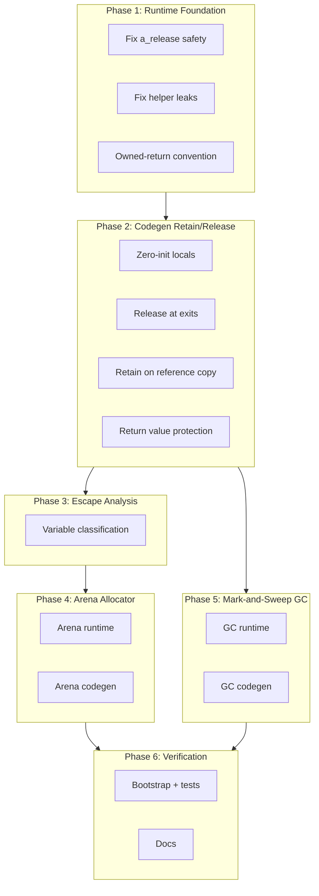

# v0.47 -- Memory Architecture

## Current State

The C runtime implements `a_retain`/`a_release` with recursive cleanup for strings, arrays, maps, and closures. But `cgen.a` **never emits those calls**. Every heap allocation is leaked. Runtime helpers (`a_str_concat`, `a_concat_n`, `a_str_join`) also leak their intermediates internally. `a_array_get` and `a_map_get` return borrowed (unretained) references. Variables are pre-declared but not zero-initialized.

## Architecture

Three tiers of memory management, built incrementally:

1. **Reference counting** (Phases 1-2): Correct ownership tracking via retain/release
2. **Arena allocation** (Phases 3-4): Scoped bulk-free for temporaries
3. **Mark-and-sweep GC** (Phase 5): Cycle collection for closures

## Ownership Model

The key design decision: **all expressions produce owned values**.

- **Constructors** (`a_int`, `a_string`, `a_array_new`): return rc=1 (new allocation)
- **Function calls** (`fn_foo(...)`): return owned (callee retains before returning)
- **Variable references** (`x`): emit `a_retain(x)` at assignment site only
- **Collection access** (`a_array_get`, `a_map_get`): return retained (add retain in runtime)
- **Scope exit**: release all locals
- **Return value**: retained before local cleanup so it survives

## Phase Breakdown

Detailed plans for each phase are in separate `plans/PLAN-v0.47.N.md` files.

- **v0.47.1** -- Runtime Foundation (fix leaks, safety, owned-return convention)
- **v0.47.2** -- Codegen Retain/Release (zero-init, release at exits, retain on copy)
- **v0.47.3** -- Escape Analysis (classify variables, optimize retain/release)
- **v0.47.4** -- Arena Allocator (scoped bulk-free for loops and temporaries)
- **v0.47.5** -- Mark-and-Sweep GC (cycle collection for closures)
- **v0.47.6** -- Verification (bootstrap, valgrind, regression, docs)
