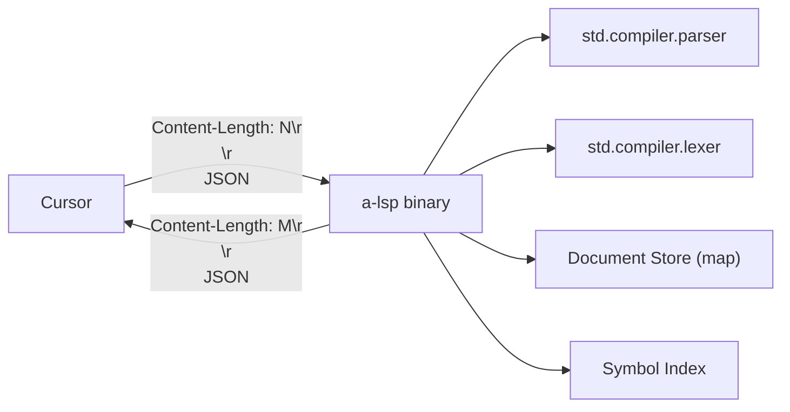

# v0.50 -- Language Server Protocol

The self-hosted parser (`std/compiler/parser.a`) and lexer (`std/compiler/lexer.a`) already produce full ASTs as tagged maps. The LSP wraps these in JSON-RPC over stdio so Cursor gets real-time feedback on every keystroke. The server is written entirely in "a", compiled to a native binary.

## Architecture



**Wire protocol**: JSON-RPC 2.0 over stdin/stdout with `Content-Length` framing.

**Document store**: In-memory `#{uri: #{content, ast, version}}` map, updated on `didOpen`/`didChange`.

**Symbol index**: Built by walking ASTs -- maps function names to `#{uri, line, signature}`. Rebuilt per-file on change.

## Phase 1: Runtime Prerequisites

Two new C runtime builtins needed for the stdio wire protocol:

- **`io.read_bytes(n)`** -- read exactly N bytes from stdin, return string. The existing `io.read_line()` reads until `\n` which won't work for Content-Length bodies that may contain newlines.

```c
// c_runtime/runtime.c
AValue a_io_read_bytes(AValue n) {
    int count = (int)n.ival;
    char* buf = malloc(count + 1);
    size_t total = 0;
    while (total < count) {
        size_t got = fread(buf + total, 1, count - total, stdin);
        if (got == 0) break;
        total += got;
    }
    buf[total] = '\0';
    AValue result = a_string_len(buf, (int)total);
    free(buf);
    return result;
}
```

- **`io.flush()`** -- `fflush(stdout)`. Without this, LSP responses buffer and the client never sees them.

Both registered in [std/compiler/cgen.a](std/compiler/cgen.a) `_builtin_map()` (in `m3` alongside other io builtins) and declared in [c_runtime/runtime.h](c_runtime/runtime.h).

## Phase 2: JSON-RPC Wire Protocol

In `src/lsp.a`, implement the LSP framing layer:

- **`_read_message()`**: Call `io.read_line()` in a loop to read headers (looking for `Content-Length: N`), read the blank separator line, then `io.read_bytes(N)` for the body. Return `json.parse(body)`.

- **`_send(msg)`**: `json.stringify(msg)` the response, prepend `Content-Length: {len}\r\n\r\n`, `print()` it, `io.flush()`.

- **`_respond(id, result)`**: Wrap result in `#{"jsonrpc": "2.0", "id": id, "result": result}`.

- **`_notify(method, params)`**: Send notification (no `id` field).

## Phase 3: LSP Lifecycle and Document Store

Core message handlers:

- **`initialize`**: Return capabilities -- `textDocumentSync: 1` (full sync), `completionProvider`, `hoverProvider`, `definitionProvider`. This is where the server declares what it supports.

- **`textDocument/didOpen`**: Parse the document content with `parser.parse()`, store `#{content, ast, version}` keyed by URI.

- **`textDocument/didChange`**: Replace stored content, re-parse, push diagnostics.

- **`textDocument/didClose`**: Remove from document store.

**Position mapping**: The parser's error `pos` is a token index, not line/column. Write `_token_pos_to_lc(source, tokens, pos)` that walks the source string counting newlines to produce `#{line, character}` for LSP (0-indexed). The lexer tracks a `pos` variable during tokenization -- we can build a token-to-offset table by re-lexing or by adding offset tracking to the lexer output.

## Phase 4: Diagnostics

On every `didOpen`/`didChange`:

1. Parse with `parser.parse(content)`
2. If result has `"tag": "ParseError"` -- convert to LSP diagnostic with severity=Error, map position to line/character range
3. Push via `textDocument/publishDiagnostics` notification
4. If parse succeeds, push empty diagnostics (clear previous errors)

This alone makes the LSP valuable -- instant red squiggles on syntax errors.

## Phase 5: Completion

On `textDocument/completion`:

- **Builtins**: Hardcoded list of all 105+ builtins with their names and insert text. Group by namespace (`str.*`, `map.*`, `io.*`, `fs.*`, `json.*`, `math.*`, `time.*`, `hash.*`, `http.*`, `env.*`, `ptr.*`). CompletionItemKind = Function.

- **User functions**: Walk the current file's AST, extract all `FnDecl` nodes, offer their names as completions.

- **Keywords**: `fn`, `let`, `mut`, `if`, `else`, `for`, `while`, `match`, `ret`, `use`, `try`, `catch`, `extern`, `true`, `false`. CompletionItemKind = Keyword.

- **Module names**: For trigger after `use `, offer known stdlib module paths (`std.compiler.parser`, `std.cli`, `std.path`, etc.).

## Phase 6: Hover

On `textDocument/hover`:

- Identify the word under the cursor position (find token at line/col by walking lexer output)
- If it's a builtin name: return a hardcoded signature string (e.g., `"fn map(arr, f) -> array"`)
- If it's a user function: find the `FnDecl` in the AST, reconstruct the signature from its params/return type
- Return as MarkedString with language "a"

## Phase 7: Go-to-Definition

On `textDocument/definition`:

- Identify the symbol under the cursor
- Look up in the symbol index (function name -> URI + line)
- For cross-module: resolve `use std.foo` to file path via `_use_path_to_file` logic, parse that file if not in document store, find the function declaration
- Return LocationLink

## Phase 8: Integration

- Add `lsp` subcommand to [src/cli.a](src/cli.a): `./a lsp` starts the server (no args, reads stdio)
- Build: `./a build src/cli.a -o a` (the CLI already handles subcommand dispatch, just add the `lsp` branch)
- Cursor config in `.vscode/settings.json` or a minimal extension `package.json` that registers `*.a` files with the LSP binary path
- Update [README.md](README.md), [PLANNING.md](PLANNING.md), [plans/ROADMAP-v0.43-to-v0.52.md](plans/ROADMAP-v0.43-to-v0.52.md)

## Key Files

- [c_runtime/runtime.c](c_runtime/runtime.c) / [runtime.h](c_runtime/runtime.h) -- add `a_io_read_bytes`, `a_io_flush`
- [std/compiler/cgen.a](std/compiler/cgen.a) -- register new builtins in `_builtin_map()`
- **`src/lsp.a`** (NEW) -- the LSP server, ~300-500 lines
- [src/cli.a](src/cli.a) -- add `lsp` subcommand
- [std/compiler/parser.a](std/compiler/parser.a) -- existing parser, used as-is
- [std/compiler/lexer.a](std/compiler/lexer.a) -- existing lexer, used as-is

## Scope Boundary

**In scope**: diagnostics, completion, hover, go-to-definition, document sync.

**Out of scope for v0.50**: rename, code actions, formatting (the Rust formatter already exists), semantic tokens, workspace symbols, references. These are incremental additions once the server works.
