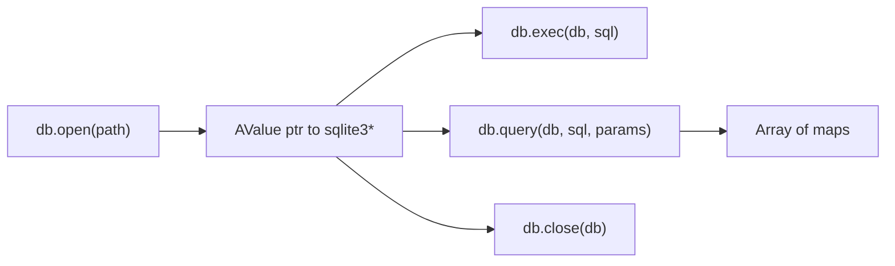

# v0.54 -- Persistence (SQLite)

## Approach

Bundle `sqlite3.c` (the amalgamation) directly into `c_runtime/`. This is a single ~240KB C file that compiles alongside `runtime.c` with no external dependencies -- consistent with the "a" philosophy of zero-setup, batteries-included.

The SQLite handle is wrapped in an `AValue` using the existing `TAG_PTR` type. The four builtins map directly to SQLite3 C API calls.

## Changes

### 1. Bundle SQLite3 -- [c_runtime/](c_runtime/)

Download the SQLite amalgamation (`sqlite3.c` + `sqlite3.h`) and place in `c_runtime/`. These are public domain files from sqlite.org.

### 2. C runtime: database builtins -- [c_runtime/runtime.c](c_runtime/runtime.c)

Four new functions:

- **`a_db_open(path)`** -- calls `sqlite3_open(path, &db)`, returns `a_ptr(db)` on success or `a_err(...)` on failure
- **`a_db_close(db)`** -- calls `sqlite3_close(db.pval)`, returns void
- **`a_db_exec(db, sql)`** -- calls `sqlite3_exec(db.pval, sql, ...)`, returns `a_ok(void)` or `a_err(errmsg)`
- **`a_db_query(db, sql, params)`** -- uses `sqlite3_prepare_v2` + `sqlite3_bind_*` + `sqlite3_step` loop. Binds params from the "a" array (int -> `sqlite3_bind_int64`, float -> `sqlite3_bind_double`, string -> `sqlite3_bind_text`, void/null -> `sqlite3_bind_null`). Returns array of maps where each row is `#{ "col_name": value, ... }` with column types mapped back to AValue (INTEGER -> `a_int`, FLOAT -> `a_float`, TEXT -> `a_string`, NULL -> `a_void`, BLOB -> `a_string` of hex)

Also declare in [c_runtime/runtime.h](c_runtime/runtime.h).

### 3. Update build toolchain

Every `gcc` invocation that compiles `runtime.c` must also compile `sqlite3.c`:

- **[build.sh](build.sh)**: Add `"$RUNTIME_DIR/sqlite3.c"` to both gcc lines (CLI + LSP). Add `-DSQLITE_THREADSAFE=0 -DSQLITE_OMIT_LOAD_EXTENSION` for a minimal build.
- **[src/cli.a](src/cli.a)**: Update `_gcc()` to include `sqlite3.c` alongside `runtime.c`. Also update `cmd_test()` which has its own inline gcc invocation.
- **[scripts/test_memory.sh](scripts/test_memory.sh)**: Update gcc lines.
- **[.github/workflows/release.yml](.github/workflows/release.yml)**: Update gcc lines.

### 4. Register builtins -- [std/compiler/cgen.a](std/compiler/cgen.a)

Add to `_builtin_map()`:
- `"db.open": "a_db_open"`, `"db.close": "a_db_close"`, `"db.exec": "a_db_exec"`, `"db.query": "a_db_query"`

Add `"db.close"` to `_void_builtins()`.

### 5. Rust VM stubs -- [src/builtins.rs](src/builtins.rs), [src/checker.rs](src/checker.rs)

Add to `is_builtin` and `fn_sigs`. VM implementation returns a stub error directing to native CLI (SQLite is native-only like `http.serve`).

### 6. Example: CRUD API -- `examples/crud.a` (new)

HTTP server + SQLite in ~50 lines: create a `users` table, serve GET/POST endpoints, return JSON.

### 7. Documentation and version bump

- [README.md](README.md): Add database builtins to the table
- [Cargo.toml](Cargo.toml): Bump to `0.54.0`
- [PLANNING.md](PLANNING.md): Append v0.54 section
