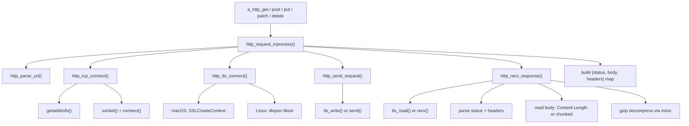

# v0.58 -- In-Process HTTP Client

## Current State

The native binary's HTTP client (`c_runtime/runtime.c` lines 1502-1601) uses `fork` + `execvp("curl", ...)` with a child process. It:
- Only supports **GET and POST** (no PUT/PATCH/DELETE)
- Returns `{status, body}` only -- **no response headers**
- Requires `curl` on the system path
- Constructs a curl argv with `-s -w "\n__HTTP_STATUS__%{http_code}" -X METHOD -H ... -d ...`

The Rust VM (`src/builtins.rs` lines 1252-1341) uses `ureq` and returns `{status, body, headers}` for all 5 methods. The native path must reach parity.

The HTTP server (`runtime.c` lines 1603-1780) already uses POSIX sockets (`socket`, `bind`, `listen`, `accept`, `recv`, `send`), providing a reference for the client socket code.

## Architecture

The new in-process HTTP client replaces the `http_request` function and everything above it (lines 1502-1601) with ~600-800 lines of new code structured as:



## Part 1: URL Parser

Add `http_parse_url()` to [c_runtime/runtime.c](c_runtime/runtime.c) (~40 lines). Extracts from a URL string:
- `scheme` ("http" or "https")
- `host` (hostname portion)
- `port` (default 80/443 based on scheme)
- `path` (path + query string, default "/")

No need to handle auth or fragments -- agent HTTP calls don't use them.

## Part 2: I/O Abstraction + TCP Connection

Define a small struct for the connection that abstracts over plain vs TLS:

```c
typedef struct {
    int fd;
    void* tls_ctx;   /* platform-specific TLS context, NULL for plain HTTP */
    int use_tls;
} HttpConn;
```

- `http_tcp_connect(host, port, timeout_ms)` -- uses `getaddrinfo()` for DNS, `socket(AF_INET, SOCK_STREAM, 0)`, non-blocking `connect()` with `poll()`/`select()` for timeout. Returns fd or -1.
- `http_io_write(conn, buf, len)` / `http_io_read(conn, buf, len)` -- dispatch to `send()`/`recv()` or TLS write/read based on `use_tls`.
- Add `#include <netdb.h>` and `#include <poll.h>` to the HTTP section.

## Part 3: Platform TLS

### macOS (Security.framework / SecureTransport)

Behind `#ifdef __APPLE__`:
- `#include <Security/Security.h>` and `#include <Security/SecureTransport.h>`
- `http_tls_connect()`: Create `SSLContextRef` via `SSLCreateContext`, set I/O functions (`SSLSetIOFuncs`) that delegate to the socket fd, set peer hostname (`SSLSetPeerDomainName`), call `SSLHandshake()`.
- `http_tls_read()` / `http_tls_write()`: Use `SSLRead()` / `SSLWrite()`.
- `http_tls_close()`: `SSLClose()` + `CFRelease()`.
- ~150 lines of platform-specific code.

### Linux (OpenSSL via dlopen)

Behind `#else` (non-Apple):
- `#include <dlfcn.h>`
- At first call, `dlopen("libssl.so", RTLD_NOW)` (try `libssl.so.3`, then `libssl.so.1.1`, then `libssl.so`). Load function pointers: `SSL_CTX_new`, `TLS_client_method`, `SSL_new`, `SSL_set_fd`, `SSL_set_tlsext_host_name`, `SSL_connect`, `SSL_read`, `SSL_write`, `SSL_shutdown`, `SSL_free`, `SSL_CTX_free`. Also `dlopen("libcrypto.so")` for any needed symbols.
- `http_tls_connect()`: Create context, create SSL object, set fd, set SNI hostname, handshake.
- `http_tls_read()` / `http_tls_write()`: Use loaded `SSL_read` / `SSL_write`.
- `http_tls_close()`: `SSL_shutdown` + `SSL_free`.
- ~150 lines.
- If `dlopen` fails (no OpenSSL on system), `http_tls_connect()` returns error. The caller falls back to curl for HTTPS URLs only.

## Part 4: HTTP/1.1 Request/Response

### Request formatting (`http_send_request`)
- Format: `METHOD PATH HTTP/1.1\r\nHost: HOST\r\n[headers]\r\n[Content-Length if body]\r\nConnection: close\r\n\r\n[body]`
- Apply user-provided headers from the AValue map
- Default `Content-Type: application/json` for POST/PUT/PATCH with body (matching Rust VM behavior)
- Send via `http_io_write()`

### Response parsing (`http_recv_response`)
- Read until `\r\n\r\n` to get status line + headers
- Parse status code from `HTTP/1.1 NNN reason`
- Parse headers into AValue map (lowercase keys, matching Rust VM behavior)
- Read body based on:
  - `Content-Length` header: read exactly N bytes
  - `Transfer-Encoding: chunked`: parse chunk sizes, read chunks, assemble
  - Neither: read until connection close
- If `Content-Encoding: gzip`, decompress body via `a_compress_gunzip()` (reuse v0.57 miniz code, or call `tinfl_decompress_mem_to_heap` directly after stripping gzip header)

### Curl fallback
- If the URL is HTTPS and TLS initialization failed, fall back to the existing `http_request` curl path (renamed to `http_request_curl_fallback`)
- If the URL is HTTP, always use in-process (no curl needed)

## Part 5: Public API -- All 5 Methods

**[c_runtime/runtime.h](c_runtime/runtime.h)** -- add declarations:
```c
AValue a_http_put(AValue url, AValue body, AValue headers);
AValue a_http_patch(AValue url, AValue body, AValue headers);
AValue a_http_delete(AValue url, AValue headers);
```

**[c_runtime/runtime.c](c_runtime/runtime.c)** -- implement all 5 using the new `http_request_inprocess()`:
- All return `{status, body, headers}` map (matching Rust VM)
- GET/DELETE: no body arg
- POST/PUT/PATCH: body arg

## Part 6: Build Wiring

**[build.sh](build.sh)** and **[bootstrap/build.sh](bootstrap/build.sh)**: On macOS, add `-framework Security` to gcc flags. Already have `$STACK_FLAGS` platform detection as a model.

**[src/cli.a](src/cli.a)** `_gcc_flags()`: Add `-framework Security` on Darwin:
```
if os == "Darwin" {
  ret "-lm -O2 -Wl,-stack_size,0x10000000 -framework Security"
}
```

**[scripts/test_memory.sh](scripts/test_memory.sh)**: Same framework flag on macOS.

**[std/compiler/cgen.a](std/compiler/cgen.a)** `_builtin_map()`: Add missing methods:
```
"http.put": "a_http_put", "http.patch": "a_http_patch", "http.delete": "a_http_delete"
```

**[src/lsp.a](src/lsp.a)**: Add builtin signatures for `http.put`, `http.patch`, `http.delete`.

## Part 7: Tests, Version, Docs

- **[tests/native/test_http.a](tests/native/test_http.a)**: Self-contained test using `http.serve` in a subprocess + `http.get`/`http.post` against it, or a simpler approach testing against a known public endpoint. Verify `{status, body, headers}` shape, verify headers map is populated.
- **Version bump**: [Cargo.toml](Cargo.toml) from `0.57.0` to `0.58.0`.
- **[.github/workflows/ci.yml](.github/workflows/ci.yml)**: Remove `curl` from Linux apt-get install (keep `gcc` only). This tests that the binary works without curl.
- **[README.md](README.md)**: Remove `curl` from requirements. Update the builtins table to show all 5 HTTP methods in native. Update HTTP client description.
- **[PLANNING.md](PLANNING.md)**: Add v0.58 changelog entry.
- **Regenerate `bootstrap/cli.c`**: After all changes, regenerate to include PUT/PATCH/DELETE mappings.

## Estimated Scope

- ~600-800 lines of new C in `runtime.c` (URL parser, TCP, TLS, HTTP/1.1, response parsing)
- ~50 lines removed (old curl code becomes fallback-only)
- ~20 lines in each of: `cgen.a`, `cli.a`, `build.sh`, `bootstrap/build.sh`, `runtime.h`, `test_memory.sh`
- New test file, README/PLANNING updates
