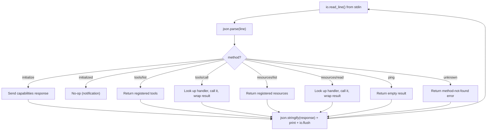

# v0.59 -- MCP Framework

## Context

MCP (Model Context Protocol) is JSON-RPC 2.0 over stdio. A client launches a server as a subprocess, sends newline-delimited JSON requests to its stdin, and reads newline-delimited JSON responses from its stdout. The lifecycle is: `initialize` handshake -> operation (tools/list, tools/call, resources/list, resources/read, ping) -> shutdown (close stdin, SIGTERM).

The **server side** can be built entirely in pure "a" using existing builtins: `io.read_line` (read JSON-RPC from stdin), `print`/`io.flush` (write JSON-RPC to stdout), `json.parse`/`json.stringify`.

The **client side** needs bidirectional pipe communication with a long-lived subprocess. The current `exec()` builtin is one-shot and cannot maintain a session. New C runtime builtins are required.

## Part 1: Subprocess Pipe Builtins

Add 4 new builtins to both runtimes for bidirectional subprocess communication. These are minimal and forward-compatible with the fuller `proc.*` set planned for v0.63.

### C runtime ([c_runtime/runtime.c](c_runtime/runtime.c))

Add ~120 lines:

```c
typedef struct {
    pid_t pid;
    int stdin_fd;    // write end -> child stdin
    int stdout_fd;   // read end <- child stdout
    int active;
} SubProcess;

#define MAX_SUBPROCS 16
static SubProcess subprocs[MAX_SUBPROCS];
```

- **`a_proc_spawn(cmd)`** -- `pipe()` x2, `fork()`, `execvp("sh", ["-c", cmd])`. Parent stores fds in `subprocs[]`, returns handle (int index). Closes unused pipe ends in parent and child.
- **`a_proc_write(handle, data)`** -- `write(subprocs[h].stdin_fd, data, len)`. Returns void on success, `Err` on failure.
- **`a_proc_read_line(handle)`** -- `read()` one byte at a time from `subprocs[h].stdout_fd` until `\n` or EOF. Returns the line (without `\n`), or `Err("eof")` on EOF.
- **`a_proc_kill(handle)`** -- `close()` both fds, `kill(pid, SIGTERM)`, `waitpid()`, mark inactive. Returns void.

### Rust VM ([src/builtins.rs](src/builtins.rs))

Add ~80 lines using `std::process::Command` with `Stdio::piped()`:

- **`proc.spawn`** -- `Command::new("sh").args(["-c", cmd]).stdin(Stdio::piped()).stdout(Stdio::piped()).spawn()`. Store in a `static Mutex<Vec<Option<Child>>>`, return index.
- **`proc.write`** -- Write to child's stdin handle.
- **`proc.read_line`** -- `BufRead::read_line()` from child's stdout. Return `Err("eof")` on empty.
- **`proc.kill`** -- `child.kill()`, `child.wait()`.

### Wiring

- [c_runtime/runtime.h](c_runtime/runtime.h) -- add declarations for `a_proc_spawn`, `a_proc_write`, `a_proc_read_line`, `a_proc_kill`
- [std/compiler/cgen.a](std/compiler/cgen.a) `_builtin_map()` -- add `"proc.spawn": "a_proc_spawn"`, etc.
- [src/builtins.rs](src/builtins.rs) `is_builtin()` -- add all 4
- [src/checker.rs](src/checker.rs) -- add type signatures
- [src/lsp.a](src/lsp.a) -- add builtin completion entries

## Part 2: `std/mcp.a` -- MCP Server (~150 lines)

Pure "a" module. No new builtins needed -- uses `io.read_line`, `print`, `io.flush`, `json.parse`, `json.stringify`.

### API

```
mcp.server(name, version) -> server_map
mcp.add_tool(server, name, description, input_schema, handler) -> server_map
mcp.add_resource(server, uri, name, handler) -> server_map
mcp.serve(server) -> void  ; enters stdio loop, never returns
```

### Internal architecture



Key implementation details:
- Server state is a map: `#{ "name": ..., "version": ..., "tools": [...], "resources": [...] }`
- Tool entries: `#{ "name": ..., "description": ..., "inputSchema": ..., "handler": fn }`
- `mcp.serve()` loops on `io.read_line()`, dispatches based on `method` field
- JSON-RPC 2.0 compliance: `jsonrpc: "2.0"`, `id` echoed, error codes (-32601 method not found, -32602 invalid params)
- `initialize` response advertises `tools` and `resources` capabilities based on what was registered
- Protocol version: `"2025-11-25"`
- Tool call result format: `#{ "content": [#{ "type": "text", "text": ... }] }`
- Handlers receive args map, return a string (auto-wrapped in content) or a content array

## Part 3: `std/mcp.a` -- MCP Client (~80 lines)

Uses the new `proc.*` builtins.

### API

```
mcp.connect(cmd) -> client_map | Err(str)
mcp.list_tools(client) -> [tool_maps] | Err(str)
mcp.call_tool(client, name, args) -> result_map | Err(str)
mcp.close(client) -> void
```

### Flow

1. `mcp.connect(cmd)` -- `proc.spawn(cmd)`, send `initialize` request, read response, send `initialized` notification, return `#{ "handle": handle, "capabilities": ..., "_next_id": 2 }`
2. `mcp.list_tools(client)` -- send `tools/list` request, read response, return tools array
3. `mcp.call_tool(client, name, args)` -- send `tools/call` request, read response, return result content
4. `mcp.close(client)` -- `proc.kill(client.handle)`

Each request: `json.stringify(request_map)` -> `proc.write(handle, line + newline)` -> `proc.read_line(handle)` -> `json.parse` -> extract result or error.

## Part 4: Examples

### `examples/mcp_server.a` (~30 lines)

A file search MCP tool. Registers one tool "search_files" that takes a `query` string and uses `fs.glob` to find matching files.

### `examples/mcp_client.a` (~20 lines)

Connects to a given MCP server command (from args), lists tools, calls the first tool, prints the result.

## Part 5: Tests, Version, Docs

- **[tests/native/test_mcp.a](tests/native/test_mcp.a)** -- Test the proc builtins (spawn a simple `echo` process, write to it, read from it). Test MCP server/client by spawning the example server and calling it from the client code.
- **[Cargo.toml](Cargo.toml)** -- bump from `0.58.0` to `0.59.0`
- **[README.md](README.md)** -- add MCP to builtins table, add proc.* builtins
- **[PLANNING.md](PLANNING.md)** -- v0.59 changelog entry
- **Regenerate [bootstrap/cli.c](bootstrap/cli.c)** -- includes new cgen mappings
- **Build script updates** -- no new C libraries needed; proc builtins use only POSIX APIs already included
