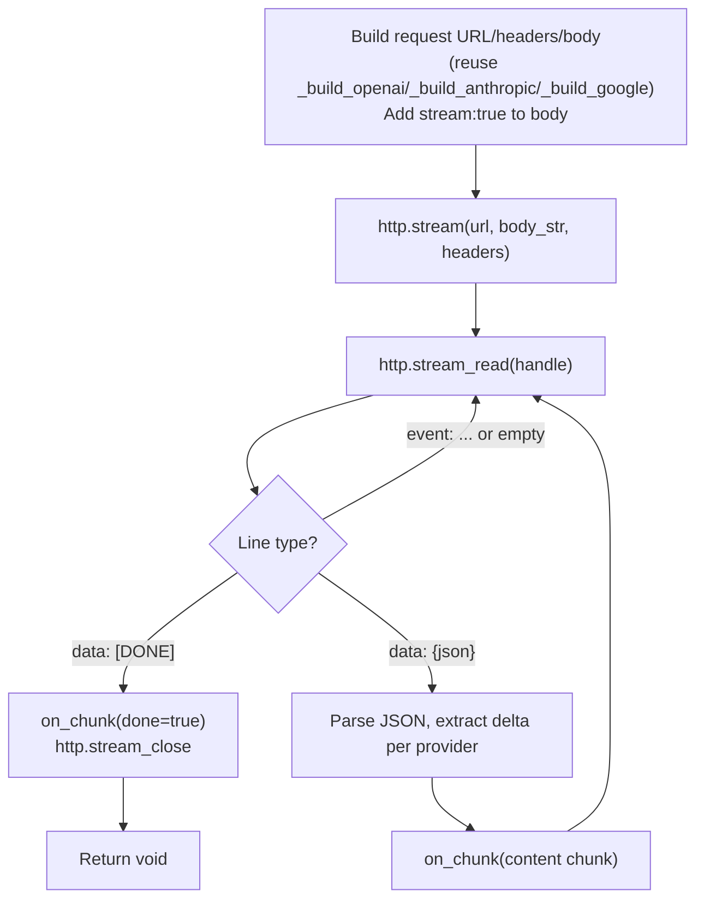

# v0.60 -- Streaming + Real-Time Protocols

## Context

LLM APIs support streaming responses via Server-Sent Events (SSE) over chunked HTTP. The current `http.post` buffers the entire response before returning, making it impossible to stream tokens to the user. WebSocket support is needed for MCP's streamable HTTP transport and general real-time use.

The existing HTTP infrastructure in both runtimes provides a solid foundation:
- **C runtime**: `HttpConn` abstraction with platform TLS, chunked transfer-encoding decoding, URL parsing, TCP connect -- all reusable
- **Rust VM**: `ureq` library with `Response::into_reader()` for streaming access

## Part 1: Streaming HTTP Builtins

Add 3 new builtins for incremental HTTP response reading. Uses a handle-pool pattern (like `proc.*`).

### API

```
http.stream(url, body, headers) -> int_handle | Err
http.stream_read(handle) -> str | Err("eof")
http.stream_close(handle) -> void
```

### C runtime (`runtime.c`, ~130 lines)

New struct and pool alongside the existing HTTP code:

```c
typedef struct {
    HttpConn conn;
    int active;
    int chunked;
    char* buf;        // decoded data buffer
    int buf_len, buf_cap;
    char* raw;        // raw bytes for chunked decoding
    int raw_len, raw_cap;
} HttpStream;

#define MAX_HTTP_STREAMS 8
static HttpStream http_streams[MAX_HTTP_STREAMS];
```

- **`a_http_stream(url, body, headers)`**: Reuses `http_parse_url`, `http_tcp_connect`, `http_tls_connect`. Sends POST request (always POST, since streaming is for LLM APIs). Reads response headers (status + headers until `\r\n\r\n`). Detects `Transfer-Encoding: chunked`. Stores conn + state in pool. Returns handle int.
- **`a_http_stream_read(handle)`**: Reads from connection into raw buffer. If chunked, decodes chunk framing into decoded buffer. Scans decoded buffer for `\n`, returns one line (stripped). Returns `Err("eof")` when connection closes.
- **`a_http_stream_close(handle)`**: Closes `HttpConn`, frees buffers, marks inactive.

Key: this reuses *all* existing HTTP infrastructure (URL parsing, TCP, TLS). The only new code is the stream pool, the header-only read, and the incremental line reader with chunked decoding.

### Rust VM (`builtins.rs`, ~70 lines)

```rust
static HTTP_STREAMS: OnceLock<Mutex<Vec<Option<BufReader<Box<dyn Read + Send>>>>>> = ...;
```

- **`http.stream`**: Use `ureq::post(url)` with headers, call `.send_string(body)`, capture headers/status, then `resp.into_reader()` -> wrap in `BufReader`, store in pool, return handle.
- **`http.stream_read`**: `reader.read_line()` on the stored BufReader. Return line or `Err("eof")`.
- **`http.stream_close`**: Drop the reader, set slot to `None`.

### Wiring

- [runtime.h](c_runtime/runtime.h): declare `a_http_stream`, `a_http_stream_read`, `a_http_stream_close`
- [cgen.a](std/compiler/cgen.a): add to `_builtin_map()`
- [builtins.rs](src/builtins.rs): add to `is_builtin()`
- [checker.rs](src/checker.rs): add type signatures
- [lsp.a](src/lsp.a): add completion entries

## Part 2: `llm.stream()` + SSE Parsing

Extend [std/llm.a](std/llm.a) with ~100 lines. No new builtins needed -- pure "a" using `http.stream*`.

### API

```
llm.stream(provider, model, messages, on_chunk, opts)
```

Where `on_chunk` is a callback receiving `#{ "content": "...", "done": false }` per token, and `#{ "content": "", "done": true, "stop_reason": "..." }` on completion.

### Internal flow



### Provider-specific SSE delta extraction

- **OpenAI**: `data.choices[0].delta.content` -- content string per chunk; `finish_reason` on final chunk
- **Anthropic**: `event: content_block_delta` has `data.delta.text`; `event: message_delta` has `data.delta.stop_reason`; `event: message_stop` signals end
- **Google**: `data.candidates[0].content.parts[0].text` per chunk

Each provider also needs `"stream": true` in the request body (OpenAI/Google) or Anthropic's streaming header (`"anthropic-beta": "messages-2023-12-15"`... actually Anthropic uses `"stream": true` in the body too).

## Part 3: WebSocket Client

Add 4 new builtins for WebSocket communication. Handle-pool pattern matching `proc.*` and `http.stream*`.

### API

```
ws.connect(url) -> int_handle | Err
ws.send(handle, msg) -> void | Err
ws.recv(handle) -> str | Err("closed")
ws.close(handle) -> void
```

### C runtime (`runtime.c`, ~300 lines)

Reuse `HttpConn` (TCP + TLS) for the transport layer. New WebSocket-specific code:

```c
typedef struct {
    HttpConn conn;
    int active;
    char* buf;
    int buf_len, buf_cap;
} WsConn;

#define MAX_WS_CONNS 8
static WsConn ws_conns[MAX_WS_CONNS];
```

- **`a_ws_connect(url)`**: Parse URL (`ws://` or `wss://`). TCP connect + optional TLS. Send HTTP upgrade request with `Sec-WebSocket-Key` (16 random bytes, base64-encoded; need ~20 lines of minimal base64 encoder and random bytes from `/dev/urandom`). Read 101 response. Store in pool, return handle.
- **`a_ws_send(handle, msg)`**: Build WebSocket text frame (opcode 0x81, client masking with 4 random bytes, XOR payload). Write to conn.
- **`a_ws_recv(handle)`**: Read frame header (2+ bytes), decode length, read payload, unmask if needed (server frames are typically unmasked). Handle ping (auto-send pong), close (return error). Return text payload.
- **`a_ws_close(handle)`**: Send close frame (opcode 0x88), close conn, mark inactive.

Minimal helpers needed:
- `ws_base64_encode()` (~20 lines) for the handshake key
- `ws_random_bytes()` (~5 lines) from `/dev/urandom` for key + masking

### Rust VM (`builtins.rs`, ~80 lines)

Add `tungstenite = "0.26"` dependency to [Cargo.toml](Cargo.toml). This provides both `ws://` and `wss://` support with proper protocol compliance.

```rust
static WS_CONNS: OnceLock<Mutex<Vec<Option<WebSocket<MaybeTlsStream<TcpStream>>>>>> = ...;
```

- **`ws.connect`**: `tungstenite::connect(url)` -> store in pool, return handle
- **`ws.send`**: `ws.send(Message::Text(msg))`
- **`ws.recv`**: `ws.read()` in a loop, auto-handle Ping, return Text messages
- **`ws.close`**: `ws.close(None)`, drop

### Wiring (same pattern as Part 1)

- [runtime.h](c_runtime/runtime.h), [cgen.a](std/compiler/cgen.a), [builtins.rs](src/builtins.rs) `is_builtin()`, [checker.rs](src/checker.rs), [lsp.a](src/lsp.a)

## Part 4: Examples

### `examples/stream_chat.a` (~35 lines)

Streaming LLM conversation that prints tokens as they arrive:

```
use std.llm

fn main() {
  let msgs = [
    #{"role": "user", "content": "Write a haiku about programming"}
  ]
  llm.stream("openai", "gpt-4o-mini", msgs, fn(chunk) {
    if !chunk["done"] {
      io.write(chunk["content"])
      io.flush()
    } else {
      print("")  ; final newline
    }
  }, #{"max_tokens": 256})
}
```

## Part 5: Tests, Version, Docs

- **[tests/native/test_stream.a](tests/native/test_stream.a)**: Test `http.stream*` builtins against a local HTTP server that sends chunked SSE-style responses (spawn `_http_server.a` or use `proc.spawn` with a simple echo server). Test `ws.*` builtins against a local WebSocket echo server (or test frame encoding/protocol via `proc.spawn`).
- **[Cargo.toml](Cargo.toml)**: add `tungstenite = "0.26"`, bump version to `0.60.0`
- **[README.md](README.md)**: add `http.stream*` and `ws.*` to builtins table, update stdlib count, add example entries
- **[PLANNING.md](PLANNING.md)**: v0.60 changelog entry
- **Regenerate [bootstrap/cli.c](bootstrap/cli.c)**: includes new cgen mappings
- **No build script changes needed**: streaming HTTP and WebSocket use the same POSIX + TLS APIs already linked

## Dependency Note

The only new dependency is `tungstenite` for the Rust VM WebSocket client. This is the standard Rust WebSocket library. It brings in `sha1`, `base64`, `httparse`, `rand`, and `utf-8` as transitive deps. The C runtime implements WebSocket from scratch using existing infrastructure (no new C libraries).
