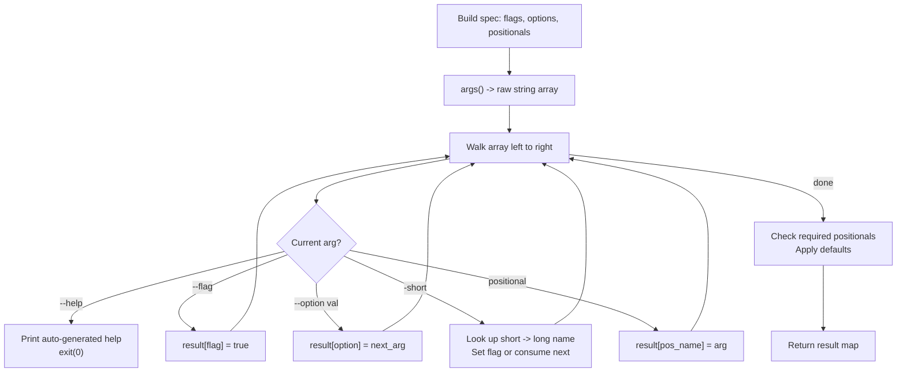

# v0.61 -- Agent Stdlib + Operational Primitives

## Context

The roadmap calls for production patterns that every agent needs: retry/backoff, caching, rate limiting, structured logging, CLI argument parsing, UUID generation, and signal handling. Most of these can be implemented as pure "a" stdlib modules using existing builtins (`time.now`, `time.sleep`, `eprintln`, `json.stringify`, `args()`). Only UUID generation and signal handling require new C/Rust runtime builtins.

Existing infrastructure to leverage:
- `time.now()` / `time.sleep()` -- already in both runtimes
- `eprintln()` -- writes to stderr in both runtimes
- `json.stringify()` -- for structured log output
- `datetime.iso()` -- for log timestamps
- `args()` -- returns raw string array (special-cased in interpreter/VM, mapped to `a_args` in cgen)
- Closures callable as `f()` / `f(args)` -- used in mcp.a handlers, http.serve, HOFs

## Part 1: New Builtins (uuid.v4, signal.on)

### `uuid.v4()` -- both runtimes

A single builtin that returns a UUID v4 string like `"550e8400-e29b-41d4-a716-446655440000"`.

**C runtime** ([runtime.c](c_runtime/runtime.c), ~25 lines): Read 16 bytes from `/dev/urandom` (reuse the existing `ws_random_bytes` helper or duplicate the pattern), set version bits (byte 6: `0x40 | (b & 0x0F)`) and variant bits (byte 8: `0x80 | (b & 0x3F)`), format as `8-4-4-4-12` hex string. Insert near the hashing section.

**Rust VM** ([builtins.rs](src/builtins.rs), ~15 lines): Read 16 bytes from `/dev/urandom` via `std::fs::File` (no new dependency needed), apply same version/variant masking, format as hex.

### `signal.on(name, handler)` -- C runtime only

**C runtime** ([runtime.c](c_runtime/runtime.c), ~50 lines): 
- Global array: `static AValue signal_handlers[32]` (indexed by signal number)
- `a_signal_on(name, handler)`: Map string name ("SIGINT", "SIGTERM", "SIGHUP", "SIGUSR1", "SIGUSR2") to signal number. Store handler closure. Install via `sigaction` with a C dispatcher function that calls `a_closure_call(signal_handlers[signum], 0)`.
- Supported signals: SIGINT (2), SIGTERM (15), SIGHUP (1), SIGUSR1 (10/30), SIGUSR2 (12/31).

**Rust VM** ([builtins.rs](src/builtins.rs)): Return a runtime error directing the user to the native CLI, same pattern as `http.serve` and `db.*`.

### Wiring

- [runtime.h](c_runtime/runtime.h): `a_uuid_v4(void)`, `a_signal_on(AValue name, AValue handler)`
- [cgen.a](std/compiler/cgen.a): `"uuid.v4": "a_uuid_v4"`, `"signal.on": "a_signal_on"`
- [builtins.rs](src/builtins.rs) `is_builtin()`: add `"uuid.v4"`, `"signal.on"`
- [checker.rs](src/checker.rs): type signatures
- [lsp.a](src/lsp.a): completion entries

## Part 2: `std/agent.a` (~100 lines)

Pure "a" module. All functions use existing builtins (`time.now`, `time.sleep`, closures).

### API

```
agent.retry(max_attempts, delay_ms, f) -> result
agent.batch(items, size, f) -> [results]
agent.pipeline(steps, input) -> result
agent.timeout(ms, f) -> result | Err("timeout")
agent.rate_limit(min_interval_ms, f) -> result
```

### Implementation notes

- **`retry`**: Loop up to `max_attempts`. Call `f()`. If not error, return. On error, sleep `delay_ms * 2^attempt` (exponential backoff), retry. Return last error on exhaustion.
- **`batch`**: Slice `items` into chunks of `size`. Call `f(chunk)` for each. Collect results.
- **`pipeline`**: Fold over `steps` array: `result = steps[i](result)`. Returns final result.
- **`timeout`**: Record `start = time.now()`. Call `f()`. Check `time.now() - start > ms`. If over, return `Err("timeout: exceeded {ms}ms")`. Otherwise return result. (Note: cannot interrupt a blocking call -- only checks after completion.)
- **`rate_limit`**: Record `last_call = time.now()`. Sleep if `now - last_call < min_interval_ms`. Call `f()`. Return result. (Stateless per-call; for stateful rate limiting across calls, the caller tracks the timestamp.)

## Part 3: `std/log.a` (~60 lines)

Pure "a" module. Structured JSON logging to stderr.

### API

```
log.info(msg)         ; {"level":"info","msg":"...","ts":"2026-04-13T...Z"}
log.warn(msg)         ; {"level":"warn","msg":"...","ts":"..."}
log.error(msg)        ; {"level":"error","msg":"...","ts":"..."}
log.debug(msg)        ; {"level":"debug","msg":"...","ts":"..."}
log.set_level(level)  ; "debug" | "info" | "warn" | "error"
log.with(key, val)    ; returns a context map for structured fields
log.log(level, msg, ctx)  ; low-level: log with extra fields
```

### Implementation notes

- Uses `eprintln(json.stringify(entry))` for output
- Timestamps via `datetime.iso(time.now())`
- Level filtering: module-level `_log_level` variable. Since "a" closures capture by value, use a function `_level()` that returns the current level from a mutable variable. Actually, top-level `let` is not supported, so use a function that returns a map acting as module state. Simpler: `log.set_level` stores the level, and each `log.*` call checks it. Use the exec/env trick: store level in `env.set("_LOG_LEVEL", level)` and read with `env.get("_LOG_LEVEL")`. This avoids mutable state issues.

## Part 4: `std/args.a` (~180 lines)

Pure "a" module. The largest new module. Provides declarative CLI argument parsing.

### API

```
args.spec() -> spec_map                              ; create empty spec
args.flag(spec, name, short, desc) -> spec_map        ; --name / -short boolean flag
args.option(spec, name, short, desc, default) -> spec  ; --name value / -short value
args.positional(spec, name, desc) -> spec              ; required positional arg
args.parse(spec) -> result_map | Err                   ; parse args() against spec
```

### Internal data flow



### Features

- Boolean flags: `--verbose` sets `"verbose": true`
- String options: `--output file.txt` sets `"output": "file.txt"`
- Short aliases: `-v` for `--verbose`, `-o` for `--output`
- Positional args: unnamed arguments in order
- `--` separator: everything after is positional
- Auto `--help`: prints name, description, flags, options, positionals
- Defaults: options get default values; flags default to `false`
- Returns `#{ "verbose": true, "output": "file.txt", "file": "main.a", ... }`

## Part 5: `std/uuid.a` (~10 lines)

Thin wrapper around the `uuid.v4()` builtin for consistency with the `use std.uuid` pattern.

```
fn v4() -> str { ret uuid.v4() }
```

## Part 6: Examples, Tests, Version, Docs

### Examples

- **`examples/cli_demo.a`** (~30 lines): Demonstrates `std.args` with flags, options, and positionals. Prints parsed result.
- Update **`examples/agent.a`** to use `std.agent` retry/pipeline patterns.

### Tests

- **`tests/native/test_agent.a`**: Test retry (with a counter that fails N times then succeeds), batch, pipeline, timeout.
- **`tests/native/test_args.a`**: Test argument parsing with various flag/option combinations.
- **`tests/native/test_uuid.a`**: Test uuid.v4() format (length 36, correct dash positions, version nibble).

### Version and docs

- [Cargo.toml](Cargo.toml): bump to `0.61.0`
- [README.md](README.md): add uuid, signal, agent, log, args to builtins/stdlib tables; update counts
- [PLANNING.md](PLANNING.md): v0.61 changelog entry
- [ROADMAP](plans/ROADMAP-v0.57-to-v1.0.md): mark v0.61 done
- Regenerate [bootstrap/cli.c](bootstrap/cli.c)

## Scope note

The roadmap mentions `agent.cache(ttl_ms, fn)` returning a memoized function. This requires mutable captured state across closure invocations, which "a" closures (capture by value) don't support directly. The plan uses an env-var trick for log level state. For `cache`, we'll provide a simpler `agent.cache_call(cache_map, key, ttl_ms, f)` that threads the cache state explicitly (same pattern as `mcp.list_tools` returning updated client maps), or defer it if the pattern proves too awkward.
