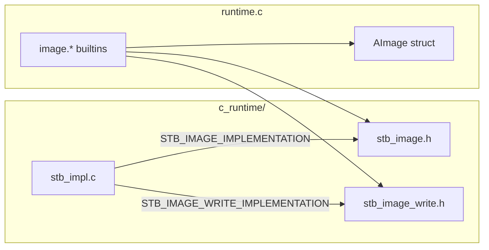

# v0.64 -- Image Processing

## Architecture

Image data is stored as an opaque `AImage*` pointer behind `TAG_PTR`, following the same pattern as SQLite's `sqlite3*` handle. Binary file I/O for images uses `fopen(..., "rb"/"wb")` directly inside the builtins (bypassing the text-oriented `io.read_file`). Resize uses a hand-rolled bilinear interpolation (no third vendor dependency). Image builtins are **native-only** -- the Rust VM returns a runtime error (same pattern as `db.*`).



## Part 1: Vendor stb_image + stb_image_write

Download the latest stable releases from the [stb GitHub repo](https://github.com/nothings/stb) (public domain / MIT):

- `c_runtime/stb_image.h` -- single-header image decoder (PNG, JPEG, BMP, GIF)
- `c_runtime/stb_image_write.h` -- single-header image encoder (PNG, BMP, JPEG, TGA)
- `c_runtime/stb_impl.c` -- tiny implementation file (~4 lines):
  ```c
  #define STB_IMAGE_IMPLEMENTATION
  #include "stb_image.h"
  #define STB_IMAGE_WRITE_IMPLEMENTATION
  #include "stb_image_write.h"
  ```

**Vendoring updates:**
- [c_runtime/VENDORS.md](c_runtime/VENDORS.md): Add stb_image section (version, upstream URL, license, date, checksums for all 3 files)
- [scripts/vendor_check.sh](scripts/vendor_check.sh): Add `check_sha256` lines for the 3 new files

## Part 2: AImage struct + builtins in C runtime

Add to [c_runtime/runtime.c](c_runtime/runtime.c) (after the existing signal handling section, ~120 lines total):

```c
typedef struct {
    unsigned char* data;  // RGBA pixel data
    int width, height, channels;
} AImage;
```

**8 builtins** (the 6 from the roadmap + 2 file convenience wrappers):

- `image.load(path)` -- `fopen(path, "rb")`, read all bytes, `stbi_load_from_memory(...)`, force 4 channels (RGBA), return `a_ptr(img)`
- `image.decode(bytes)` -- `stbi_load_from_memory(sval->data, sval->len, ...)`, force RGBA, return `a_ptr(img)`
- `image.save(image, path)` -- detect format from extension (`.png`/`.bmp`/`.jpg`), call `stbi_write_png`/`stbi_write_bmp`/`stbi_write_jpg` to file
- `image.encode(image, format)` -- `stbi_write_png_to_func`/`stbi_write_bmp_to_func`/`stbi_write_jpg_to_func` with a callback that accumulates into a buffer, return `a_string_len(buf, size)`
- `image.width(image)` -- return `a_int(img->width)`
- `image.height(image)` -- return `a_int(img->height)`
- `image.resize(image, w, h)` -- bilinear interpolation, allocate new `AImage*`, return `a_ptr(new_img)`
- `image.pixels(image)` -- return `AArray` of ints, each `(r << 24) | (g << 16) | (b << 8) | a`

Add declarations to [c_runtime/runtime.h](c_runtime/runtime.h):
```c
/* Image processing */
AValue a_image_load(AValue path);
AValue a_image_decode(AValue bytes);
AValue a_image_save(AValue image, AValue path);
AValue a_image_encode(AValue image, AValue format);
AValue a_image_width(AValue image);
AValue a_image_height(AValue image);
AValue a_image_resize(AValue image, AValue w, AValue h);
AValue a_image_pixels(AValue image);
```

## Part 3: Wiring

- [std/compiler/cgen.a](std/compiler/cgen.a) `_builtin_map()`: Add all 8 `"image.*": "a_image_*"` entries
- [src/builtins.rs](src/builtins.rs): Add native-only error for `"image.load" | "image.decode" | ... =>` (same pattern as `db.*`); add all 8 to `is_builtin()`
- [src/checker.rs](src/checker.rs): Type signatures -- `image.load` returns `Unknown` (opaque ptr), `image.width`/`height` return `I64`, `image.pixels` returns `Array(Unknown)`, `image.resize` returns `Unknown`, `image.encode` returns `Str` (bytes as string), `image.decode`/`image.save`/`image.encode` take `Str`/`Unknown` as appropriate
- [src/lsp.a](src/lsp.a): 8 completion entries with signatures

## Part 4: Build script updates

All 4 build scripts that compile C files need `stb_impl.c` added:

- [build.sh](build.sh) line 40: Add `"$RUNTIME_DIR/stb_impl.c"` to gcc command
- [bootstrap/build.sh](bootstrap/build.sh) lines 29+42: Add `STB_IMPL_C` variable and include in gcc
- [src/cli.a](src/cli.a) `_gcc()` function: Add `stb_impl_c` to the join array
- [src/cli.a](src/cli.a) `_test_dir()` function: Add stb_impl.c to the gcc command
- [.github/workflows/ci.yml](.github/workflows/ci.yml) line 99: Add `c_runtime/stb_impl.c` to gcc command

## Part 5: Example + Test

- **`examples/image_demo.a`** (~30 lines): Load an image, print dimensions, resize to 128x128, save as PNG. Demonstrate `image.pixels` by extracting a few pixel values.
- **`tests/native/test_image.a`** (~40 lines): Create a minimal valid PNG in memory (programmatically via encode), decode it back, verify width/height, resize, verify new dimensions, test pixels array length. Self-contained (no external image files needed).

## Part 6: Docs + Version

- [Cargo.toml](Cargo.toml): bump to `0.64.0`
- [README.md](README.md): Add "Image" row to builtins table, update counts (30 modules -> no, builtins 135+ -> 145+), add examples
- [PLANNING.md](PLANNING.md): v0.64 changelog entry
- [plans/ROADMAP-v0.57-to-v1.0.md](plans/ROADMAP-v0.57-to-v1.0.md): Mark v0.64 done
- Regenerate [bootstrap/cli.c](bootstrap/cli.c)
