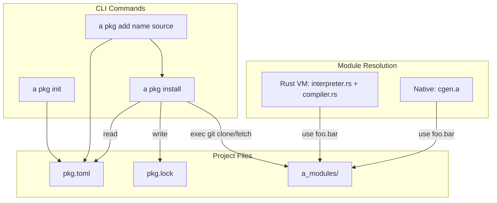

# v0.65 -- Package Manager

## Architecture



## Part 1: `std/semver.a` (~50 lines)

New pure "a" module for version parsing and comparison.

**API:**
- `semver.parse(str) -> map` -- parse "1.2.3" into `#{"major": 1, "minor": 2, "patch": 3}`
- `semver.compare(a, b) -> int` -- -1/0/1 comparison
- `semver.satisfies(version, constraint) -> bool` -- check `"^1.0"`, `"~1.2"`, `">=1.0.0"`, exact
- `semver.to_str(v) -> str` -- format back to "1.2.3"

Keep it simple for v0.65: support exact (`1.2.3`), caret (`^1.2` = >=1.2.0, <2.0.0), tilde (`~1.2` = >=1.2.0, <1.3.0), and comparison operators (`>=`, `>`, `<=`, `<`).

Uses: `str.split`, `str.starts_with`, `int()` for parsing.

## Part 2: `std/pkg.a` (~200 lines)

Core package manager logic as a reusable stdlib module.

**Manifest format** (`pkg.toml`):
```toml
[package]
name = "my-project"
version = "0.1.0"

[deps]
router = "github:user/a-router@^1.0"
utils = "github:user/a-utils@0.2.0"
```

**Lockfile format** (`pkg.lock`, also TOML):
```toml
[[package]]
name = "router"
version = "1.2.0"
source = "github:user/a-router"
commit = "abc123def456"
```

**API:**
- `pkg.init(dir)` -- create `pkg.toml` with name from `path.basename(dir)`, version "0.1.0", empty deps
- `pkg.read_manifest(dir) -> map` -- parse `pkg.toml`
- `pkg.write_manifest(dir, manifest)` -- write `pkg.toml`
- `pkg.add_dep(dir, name, source)` -- add dependency to manifest, then install
- `pkg.install(dir)` -- resolve all deps, fetch via git, populate `a_modules/`
- `pkg.parse_source(source_str) -> map` -- parse `"github:user/repo@^1.0"` into `#{"host": "github", "repo": "user/repo", "constraint": "^1.0"}`

**Install flow:**
1. Read `pkg.toml` deps
2. For each dep, parse the source string
3. Check if already in `pkg.lock` with a satisfying version
4. If not, fetch git tags via `exec("git ls-remote --tags ...")`, find best matching version
5. Clone repo to a temp dir, checkout the tag
6. Copy `.a` files to `a_modules/{name}/`
7. Write/update `pkg.lock` with resolved versions and commits

Uses: `use std.toml`, `use std.semver`, `use std.path`

## Part 3: CLI commands in [src/cli.a](src/cli.a)

Add `pkg` subcommand to the dispatch chain in `main()`, following the existing `cache` pattern for nested subcommands.

**New functions:**
- `cmd_pkg_init()` -- calls `pkg.init(fs.cwd())`
- `cmd_pkg_add(name, source)` -- calls `pkg.add_dep(fs.cwd(), name, source)`
- `cmd_pkg_install()` -- calls `pkg.install(fs.cwd())`

**Dispatch:**
```
if subcmd == "pkg" {
  if len(argv) < 2 { _die("usage: a pkg <init|add|install>") }
  if argv[1] == "init" { cmd_pkg_init() }
  if argv[1] == "add" { cmd_pkg_add(argv[2], argv[3]) }
  if argv[1] == "install" { cmd_pkg_install() }
}
```

Update `_usage()` to include `pkg init`, `pkg add`, `pkg install`.

## Part 4: Module resolution -- `a_modules/` support

Both resolution paths need to check `a_modules/` as an additional search location.

### Rust VM: [src/interpreter.rs](src/interpreter.rs) + [src/compiler.rs](src/compiler.rs)

In `load_module`, after checking `source_dir` and `cwd`, add a third fallback:

```rust
// Check a_modules/ (walk up from source_dir to find it)
if !file_path.exists() {
    let mut search = self.source_dir.clone();
    loop {
        let modules_path = search.join("a_modules").join(&rel_path);
        let mut mp = modules_path.clone();
        mp.set_extension("a");
        if mp.exists() {
            file_path = mp;
            break;
        }
        if !search.pop() { break; }
    }
}
```

Same change in both `interpreter.rs` `load_module` and `compiler.rs` `load_module`.

### Native cgen: [std/compiler/cgen.a](std/compiler/cgen.a)

Update `_use_path_to_file` to check `a_modules/` as a fallback:

```a
fn _use_path_to_file(path_arr) -> str {
  let rel = str.concat(str.join(path_arr, "/"), ".a")
  if fs.exists(rel) { ret rel }
  let mod_path = str.concat("a_modules/", rel)
  if fs.exists(mod_path) { ret mod_path }
  ret rel
}
```

## Part 5: Example + Test

- **`examples/pkg_demo.a`** (~25 lines): Initialize a project, show the generated manifest, demonstrate the parsed output.
- **`tests/native/test_semver.a`** (~40 lines): Test parse, compare, satisfies for exact/caret/tilde/comparison constraints.
- **`tests/native/test_pkg.a`** (~35 lines): Test manifest read/write, source string parsing, init creates valid TOML.

## Part 6: Docs + Version

- [Cargo.toml](Cargo.toml): bump to `0.65.0`
- [README.md](README.md): Add package manager section, update module count (30 modules), add examples
- [PLANNING.md](PLANNING.md): v0.65 changelog entry
- [ROADMAP](plans/ROADMAP-v0.57-to-v1.0.md): mark v0.65 done
- Regenerate [bootstrap/cli.c](bootstrap/cli.c)
