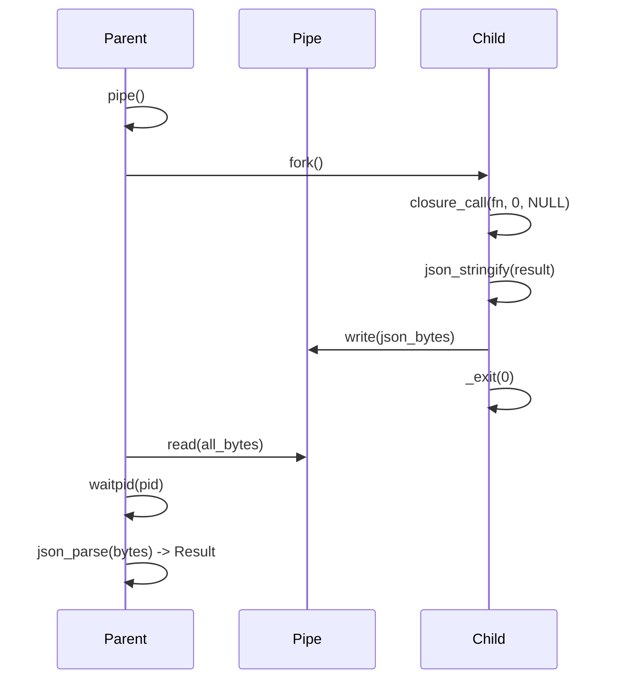

# v0.67 -- Native Concurrency

## Context

The Rust VM implements `spawn`, `await`, `await_all`, `parallel_map`, `parallel_each`, `timeout` using `std::thread` in [src/vm.rs](src/vm.rs). The C runtime has zero concurrency support beyond subprocesses (`proc.spawn`). The native `./a` binary cannot run any code from [tests/test_concurrency.a](tests/test_concurrency.a).

## Design: Fork + Pipe + JSON

After `fork()`, the child process gets a full copy of parent memory -- closures (function pointers + captured env) just work without serialization. Only the **result** needs to cross the process boundary, serialized via JSON through a pipe.



## API Parity with Rust VM

All six builtins, matching signatures from [tests/test_concurrency.a](tests/test_concurrency.a):

- `spawn(fn() => expr)` -> int handle. Fork child, call closure, write JSON result to pipe.
- `await(handle)` -> Result. Read pipe, waitpid, parse JSON. Double-await returns Err.
- `await_all([handle, ...])` -> [Result, ...]. Await each handle in order.
- `parallel_map(array, fn(x) => expr)` -> [values]. Fork per element (capped at CPU count via `sysconf(_SC_NPROCESSORS_ONLN)`), batch if array > CPU count, collect results in order.
- `parallel_each(array, fn(x) => expr)` -> void. Same as parallel_map but discard results.
- `timeout(ms, fn() => expr)` -> Result. Fork, `poll()` on pipe fd with ms deadline. Kill child on expiry, return `Err("timeout")`.

Task handles are integers indexing a global `tasks[]` table, matching the `proc.spawn` pattern at line 840 of [c_runtime/runtime.c](c_runtime/runtime.c).

## Changes

### 1. C runtime: [c_runtime/runtime.c](c_runtime/runtime.c) + [c_runtime/runtime.h](c_runtime/runtime.h)

Add ~150-200 lines implementing the six functions. Key patterns:

- **Task table**: `static struct { pid_t pid; int pipe_fd; int active; } a_tasks[64];`
- **Child protocol**: Child writes `"OK:" + json` or exits non-zero (parent sees `Err("task failed")`). For `fail()` in children: the child exits with code 1, parent detects via `waitpid` and returns Err.
- **parallel_map batching**: `sysconf(_SC_NPROCESSORS_ONLN)` to get CPU count; fork in batches of that size.
- **timeout**: `poll(pipe_fd, POLLIN, ms)` for deadline; `kill(pid, SIGKILL)` + `waitpid` on expiry.

### 2. Codegen: [std/compiler/cgen.a](std/compiler/cgen.a)

Add to the builtin map (in `_builtin_map()`):

```
"spawn": "a_spawn", "await": "a_await", "await_all": "a_await_all",
"parallel_map": "a_parallel_map", "parallel_each": "a_parallel_each",
"timeout": "a_timeout"
```

### 3. Native test: `tests/native/test_concurrency.a` (new)

Port the key tests from [tests/test_concurrency.a](tests/test_concurrency.a), adapted for native compilation (no `std.testing`, uses custom assert helper). Skip `test_concurrent_eval` (requires eval builtin) and `test_spawn_returns_task_handle` (type_of returns "int" not "task" in native path).

### 4. Docs + version bump

- [Cargo.toml](Cargo.toml): bump to `0.67.0`
- [src/lsp.a](src/lsp.a): bump serverInfo version
- [README.md](README.md): add concurrency builtins to native CLI section
- [PLANNING.md](PLANNING.md): v0.67 changelog
- [plans/ROADMAP-v0.57-to-v1.0.md](plans/ROADMAP-v0.57-to-v1.0.md): mark v0.67 done
- Regenerate [bootstrap/cli.c](bootstrap/cli.c)
