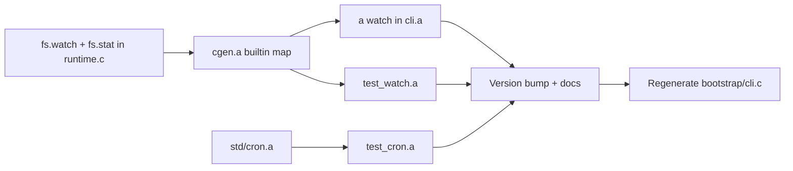

# v1.1 -- Watch and React

## Scope

Four deliverables, in dependency order:

1. **`fs.watch` builtin** -- C runtime file watcher (kqueue on macOS, inotify on Linux)
2. **`std/cron.a`** -- Pure "a" stdlib module for scheduling recurring/one-shot tasks
3. **`a watch program.a`** -- CLI subcommand that recompiles and re-runs on file change
4. **Tests, example, version bump, docs**

Hot module reload (recompiling a single module without restarting the process) is deferred -- too much infrastructure for v1.1. Instead, `a watch` does full recompile+restart, which is what most development tools do and is already fast (~200ms for the full CLI).

---

## 1. `fs.watch` -- C runtime builtin

Add `a_fs_watch(path, callback)` to [c_runtime/runtime.c](c_runtime/runtime.c). Platform-split with `#ifdef __APPLE__`:

**macOS (kqueue):**
- Open the target path with `open(path, O_EVTONLY)`
- Create a kqueue fd with `kqueue()`
- Register `EVFILT_VNODE` with `NOTE_WRITE | NOTE_DELETE | NOTE_RENAME | NOTE_ATTRIB | NOTE_EXTEND`
- For directories: also watch contents via `opendir`/`readdir` to detect new files
- Blocking `kevent()` loop; on event, call `a_closure_call(callback, 1, event_map)` where event_map is `#{"path": "...", "event": "modify"|"create"|"delete"}`
- Break on `NOTE_DELETE` of the watched path itself, or if callback returns `Err`

**Linux (inotify):**
- `inotify_init1(IN_CLOEXEC)`
- `inotify_add_watch(fd, path, IN_MODIFY | IN_CREATE | IN_DELETE | IN_MOVED_TO | IN_MOVED_FROM)`
- Blocking `read()` loop on the inotify fd; parse `struct inotify_event`, call callback with same map shape
- Same break conditions

**Both platforms:**
- ~120 lines total (60 per platform)
- Function signature: `AValue a_fs_watch(AValue path, AValue callback)`
- Declare in [c_runtime/runtime.h](c_runtime/runtime.h)
- Register in [std/compiler/cgen.a](std/compiler/cgen.a) `_builtin_map()` as `"fs.watch": "a_fs_watch"` in the `m3` map (alongside other fs builtins)
- Add `"fs.watch"` to `_void_builtins()` (it blocks like `http.serve`)

**Also add `fs.stat`** for the cron module (returns `#{"size": int, "mtime": int, "is_dir": bool}`):
- ~15 lines in runtime.c using POSIX `stat()`
- Useful for poll-based watching and general file metadata

---

## 2. `std/cron.a` -- Task scheduler

Pure "a" module, no C changes. Pattern follows [std/agent.a](std/agent.a).

```
; std/cron.a -- Lightweight task scheduler
; schedule, once, run_loop

fn schedule(interval_ms, f) -> map        ; returns task handle
fn once(delay_ms, f) -> map               ; one-shot task
fn cancel(task) -> void                   ; mark task cancelled
fn run_loop(tasks) -> void                ; blocking loop, runs until all tasks are done/cancelled
fn run_for(tasks, duration_ms) -> void    ; run loop for a bounded duration
```

Implementation:
- Tasks are maps: `#{"interval": ms, "next_run": timestamp, "fn": f, "once": bool, "cancelled": false}`
- `run_loop` iterates tasks, checks `time.now() >= next_run`, calls `f()`, updates `next_run`
- Sleeps for `min(time_until_next_task, 100)` ms between iterations to avoid busy-waiting
- ~60-80 lines

---

## 3. `a watch program.a` -- CLI subcommand

Add to [src/cli.a](src/cli.a):

- New `fn cmd_watch()` function
- New `if subcmd == "watch"` branch in `main()` before the final `_die`
- Update `_usage()` with `  watch program.a          recompile and run on file change`

**Implementation strategy** (does NOT use `fs.watch` -- uses `exec` + `stat` polling for simplicity, since `cmd_watch` runs in the CLI process which is already compiled C and can't easily call its own builtins on arbitrary user code):

1. Parse the source file to find `use` declarations, build a file list (source + all imported modules)
2. Record `mtime` for each file via `fs.stat`
3. Compile and run the program as a background process (`exec("./a run " + path)` or direct compile+exec)
4. Poll every 500ms: check mtimes against stored values
5. On change: kill the running process, recompile, re-run, update mtimes
6. Handle SIGINT to clean up child process

**Alternative (simpler, preferred):** Since `a watch` is a CLI feature and the CLI is already a compiled "a" program, it can use `fs.watch` directly once the builtin exists. The watch loop:

1. Compile and fork-exec the target program
2. `fs.watch` on the source directory with a callback that sets a "changed" flag
3. On change: kill child, recompile, restart

~80-100 lines in cli.a.

---

## 4. Tests, example, version bump, docs

**Tests:**
- `tests/native/test_watch.a` -- test `fs.watch` by writing to a temp file and verifying the callback fires (use `spawn` to run watcher in background, write file in main process, `await` result)
- `tests/native/test_cron.a` -- test `cron.schedule`, `cron.once`, `cron.run_for` with short intervals

**Example:**
- `examples/watch_demo.a` -- simple file watcher that prints changes: demonstrates `fs.watch` directly

**Version and docs:**
- `Cargo.toml`: `1.0.0` -> `1.1.0`
- `src/lsp.a`: version bump
- `PLANNING.md`: add v1.1.0 changelog
- `ROADMAP-v1.1-to-v2.0.md`: mark v1.1 as DONE
- `README.md`: update stats, add `a watch` to CLI usage, add `std.cron` to module list
- Regenerate `bootstrap/cli.c`

---

## File change summary

| File | Change |
|------|--------|
| `c_runtime/runtime.c` | Add `a_fs_watch()` (~120 lines, kqueue/inotify), `a_fs_stat()` (~15 lines) |
| `c_runtime/runtime.h` | Declare `a_fs_watch`, `a_fs_stat` |
| `std/compiler/cgen.a` | Add `"fs.watch"`, `"fs.stat"` to builtin map and void builtins |
| `std/cron.a` | NEW -- schedule, once, cancel, run_loop, run_for (~80 lines) |
| `src/cli.a` | Add `cmd_watch`, dispatch branch, update `_usage` |
| `tests/native/test_watch.a` | NEW -- fs.watch tests |
| `tests/native/test_cron.a` | NEW -- cron module tests |
| `examples/watch_demo.a` | NEW -- file watcher demo |
| `Cargo.toml` | 1.0.0 -> 1.1.0 |
| `src/lsp.a` | 1.0.0 -> 1.1.0 |
| `PLANNING.md` | Add v1.1.0 section |
| `README.md` | Update stats, CLI usage, module list |
| `bootstrap/cli.c` | Regenerated |

---

## Verification

- `./build.sh` still works (gcc bootstrap + self-host)
- `./a test tests/native/` -- all suites pass including new ones
- `./a watch examples/hello.a` -- modifying `hello.a` triggers recompile+rerun
- `echo 'fn main() { fs.watch("/tmp/test_dir", fn(e) { println(e) }) }' | ./a run -` + touching a file in `/tmp/test_dir` prints the event
- Self-hosting chain still works

## Dependency graph


